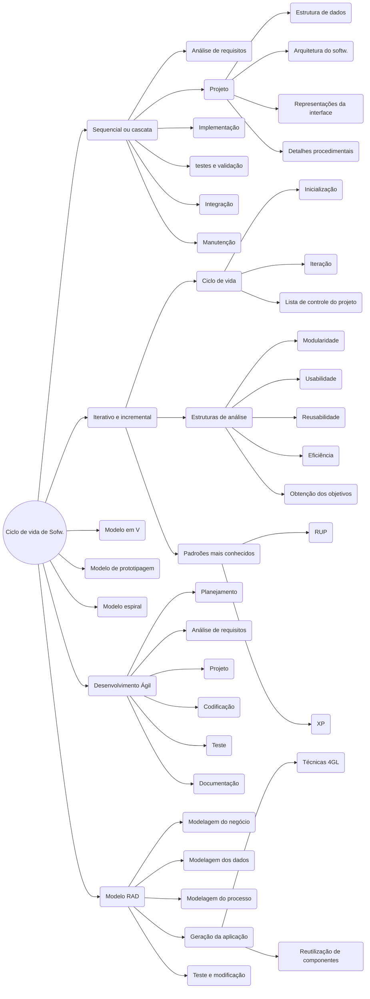

**Modelos de Ciclo de vida de pojetos de software**

```mermaid
graph LR

    CICLO((Ciclo de vida de Sofw.)) -->SEQ(Sequencial ou cascata)
    SEQ --> ANA(Análise de requisitos)

    SEQ --> PRO(Projeto)
    PRO --> PRO1(Estrutura de dados)
    PRO --> PRO2(Arquitetura do softw.)
    PRO --> PRO3(Representações da interface)
    PRO --> PRO4(Detalhes procedimentais)

    SEQ --> SEQ1(Implementação)
    SEQ --> SEQ2(testes e validação)
    SEQ --> SEQ3(Integração)
    SEQ --> SEQ4(Manutenção)

    CICLO --> IT(Iterativo e incremental)
    IT --> VIDA(Ciclo de vida)
    VIDA --> VIDA1(Inicialização)
    VIDA --> VIDA2(Iteração)
    VIDA --> VIDA3(Lista de controle do projeto)

    IT --> EST(Estruturas de análise)
    EST --> EST1(Modularidade)
    EST --> EST2(Usabilidade)
    EST --> EST3(Reusabilidade)
    EST --> EST4(Eficiência)
    EST --> EST5(Obtenção dos objetivos)

    IT --> PAD(Padroões mais conhecidos)
    PAD --> PAD1(RUP)
    PAD --> PAD2(XP)

    CICLO --> MOD1(Modelo em V)
    CICLO --> MOD2(Modelo de prototipagem)
    CICLO --> MOD3(Modelo espiral)

    CICLO --> DES(Desenvolvimento Ágil)
    DES --> DES1(Planejamento)
    DES --> DES2(Análise de requisitos)
    DES --> DES3(Projeto)
    DES --> DES4(Codificação)
    DES --> DES5(Teste)
    DES --> DES6(Documentação)

    CICLO --> RAD(Modelo RAD)
    RAD --> RAD1(Modelagem do negócio)
    RAD --> RAD2(Modelagem dos dados)
    RAD --> RAD3(Modelagem do processo)
    RAD --> RAD4(Geração da aplicação)
    RAD4 --> RAD41(Técnicas 4GL)
    RAD4 --> RAD42(Reutilização de componentes)
    RAD --> RAD5(Teste e modificação)
```
