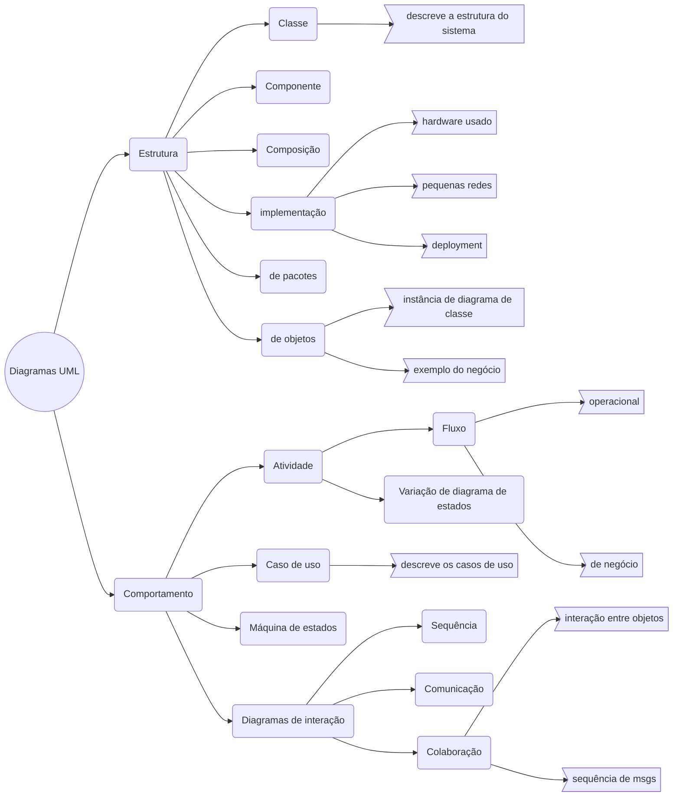

O Modelo Unificado de Linguagem - UML, é uma Linguagem para visualizar, especificar, construir e documentar a estrutura e o comportamento de um sistema de software.

```mermaid
graph LR

    UML((Diagramas UML)) -->EST(Estrutura)
    EST --> CLA(Classe)
    CLA --> CLA1>descreve a estrutura do sistema]
    EST --> COMP1(Componente)
    EST --> COMP2(Composição)
    EST --> IMP(implementação)
    IMP --> IMP1>hardware usado]
    IMP --> IMP2>pequenas redes]
    IMP --> IMP3>deployment]
    EST --> PAC(de pacotes)
    EST --> OBJ(de objetos)
    OBJ --> OBJ1>instância de diagrama de classe]
    OBJ --> OBJ2>exemplo do negócio]

    UML --> COM(Comportamento)
    COM --> ATI(Atividade)
    ATI --> FLU(Fluxo)
    FLU --> FLU1>operacional]
    FLU --> FLU2>de negócio]
    ATI --> VAR(Variação de diagrama de estados)
    COM --> CAS(Caso de uso)
    CAS --> DES>descreve os casos de uso]
    COM --> MAQ(Máquina de estados)
    COM --> DIA(Diagramas de interação)
    DIA --> SEQ(Sequência)
    DIA --> COMu(Comunicação)
    DIA --> COL(Colaboração)
    COL --> COL1>interação entre objetos]
    COL --> COL2>sequência de msgs]
```

