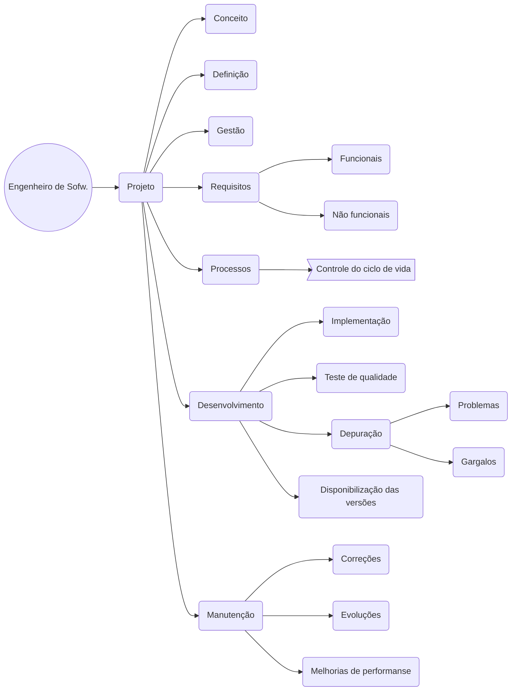

**Profissional regulamentado pelo CREA - Conselho Federal de Egenharia e Agronomia, que é responsável pelo projeto e estrutura do desenvolvimento de software**

# Referência: 
* [Código Fonte TV no TouTube](https://www.youtube.com/watch?v=wdU9L3DqU2w&ab_channel=C%C3%B3digoFonteTV)
* [Código Fonte TV no TouTube Regulamentação](https://www.youtube.com/watch?v=9KKczlUdItg&ab_channel=C%C3%B3digoFonteTVC%C3%B3digoFonteTVVerificado)
