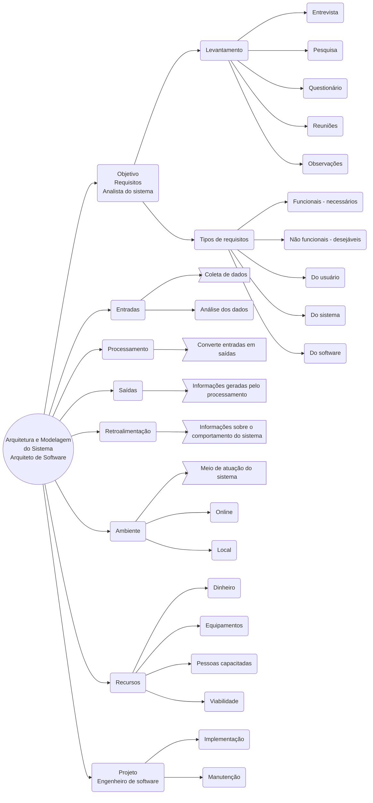

A arquitetura de software projeta e documenta o sistema, define o que vai ser usado (requisitos) e o que não vai ser usado - evitando perda de tempo, estrutura os dados, seu processamento, as informações geradas, seu ambiente, recursos, a implementação e manutenção do projeto.

## Modelagem do Sistema
- Objetivo - Requisitos
  - Levantamento
     - Entrevista
     - Pesquisa
     - Questionário
     - Reuniões
     - Observações
   - Tipos de requisitos - Analista do sistema
     - Funcionais - necessidades
     - Não funcionais - desejáveis
     - Do usuário - quem interage
     - Do sistema
     - Do software
- Entradas
   - Coleta de dados
   - Análise dos dados
- Processamento - Converte entradas em saídas
- Saídas - Informações geradas pelo processamento
- Retroalimentação - Informações sobre o comportamento do sistema
- Ambiente - Meio de atuação do sistema
   - Online
   - Local
- Recursos
   - Dinheiro
   - Equipamentos
   - Pessoas capacitadas
- Viabilidade
- Projeto
  - Implementação
  - Manutenção

## Referência

PEREIRA, Rômulo. POO Java - Introdução a Sistemas. **YouTube**, 2021. Disponível em <https://www.youtube.com/watch?v=bIjXgoqhZcg&list=PL-aWZs7H0EAwGm-lD96-l4G7rG2eN4HKG&index=1>. Acessado em 5 dejunho de 2021.