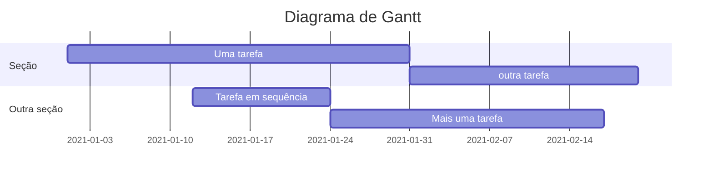

O tempo é um recurso valioso que deve ser bem gerenciado em qualquer projeto, para isso existem ferramentas que organizam as tarefas permitindo seu controle visualmente.

## Objetivo

Listar as principais ferramentas e diagramas de gerenciamento de tarefas em administração de projetos.

## Ciclo PDCA

O PDCA pode ser identificado como o Ciclo de Shewhart, e foi desenvolvido em 1930 por Walter Andrew Shewhart, engenheiro e físico, que enquanto trabalhando no Bell Laboratories, apresentou tal ferramenta como instrumento de excelência de gestão de qualidade. Analisando estatisticamente o controle de processos, ele criou um modelo capaz de ser implantado na abordagem de qualquer situação, o PDCA signica:

- Plan: Planejamento da Atividade;
- Do: Execução da Atividade;
- Check: Verificação do andamento da Atividade;
- Action: Ação nos Resultados.

## Matriz de Eisenhower

Criada pelo 34º presidente dos Estados Unidos, Dwight Eisenhower, a Matriz de Eisenhower é uma ferramenta utilizada para priorizar tarefas e orientar os processos de tomada de decisão nas organizações. É uma  forma de categorizar as atividades que precisam ser feitas de acordo com dois critérios básicos: urgência e importância.

## 5W2H

É uma ferramenta simples e prática usada para o planejamento estratégico e operacional de projetos e atividades. É constituído de um checklist de perguntas para o projeto administrativo de atividades, prazos e responsabilidades, com a função de definir o que será feito, porque, onde, quem irá fazer, quando, como e quanto vai custar.[^1]

Os 5W significam:

- What (o que será feito?)
- Why (por que será feito?)
- Where (onde será feito?)
- When (quando será feito?)
- Who (por quem será feito?)

Os 2H significam:

- How (como será feito?)
- How much(quanto vai custar?)

Exemplo 5W2H fonte: [heflo](https://www.heflo.com/)

## Kanban

Kanban é um termo japonês que significa “cartão”. Ele é um sistema de gestão visual para controle de tarefas e fluxos de trabalho através da utilização de colunas e cartões. [^2]

Criado na década de 60 como uma parte do Sistema Toyota de Produção com o objetivo de controlar o estoque de materiais para não exceder nem faltar produtos, provocando um equilíbrio entre o estoque e a linha de produção.

Esse sistema funciona através de um quadro com colunas e cartões coloridos, onde as colunas representam os produtos ou os status de fabricação do produto e as cores representam o nível de urgência para a produção de cada produto.

Atualmente, entretanto, o kanban transpôs os limites da indústria e é utilizado também em equipes de marketing, desenvolvimento de software, prestação de serviços e muitas outras, como uma ferramenta de gestão de tarefas.

Como funciona, o kanban é composto basicamente de:

- Cartões - representa  uma tarefa ou ação que precisa ser tomada;
- Colunas - representam os status dos cartões. Por exemplo: A Fazer, Em Execução e Feito;
- Quadro - onde são organizados os cartões e colunas.

Exemplo de Kanbam

## Diagrama de Gantt

Um gráfico de Gantt é um tipo de gráfico de barras, desenvolvido pela primeira vez por Karol Adamiecki em 1896, e independentemente por Henry Gantt na década de 1910, que ilustra um cronograma de projeto e a quantidade de tempo que levaria para qualquer projeto ser concluído. Os gráficos de Gantt ilustram o número de dias entre as datas de início e término dos elementos terminais e elementos de resumo de um projeto.[^3]

Os gráficos de Gantt registrarão cada tarefa agendada como uma barra contínua que se estende da esquerda para a direita. O eixo "x" representa o tempo e o eixo "y" registra as diferentes tarefas e a ordem em que devem ser concluídas.

## Diagrama de Pert

PERT é um acrônimo (do inglês) para a Técnica de Revisão de Avaliação de Programa. Um diagrama de PERT é uma ferramenta de gerenciamento de projetos usada para analisar cada tarefa envolvida na conclusão de um projeto. Voltado para projetos de grande escala, os diagramas de PERT (ou gráficos de PERT) identificam o tempo necessário para concluir cada tarefa, estimando os requisitos de tempo mais curtos, longos e prováveis.[^4]

Principais objetivos:

- Definir os prazos à sua equipe.
- Mostrar uma sequência de execução de tarefas.
- Administrar o tempo e os recursos com mais eficiência.
- Dividir um projeto grande em tarefas menores.
- Reduzir o desperdício e os custos na conclusão do projeto.

Exemplo de Diagrama de Pert CPM.

## Diagrama CPM

 O Método do caminho crítico (CPM) é usado em projetos previsíveis e que ocorrem com frequência, usado para controlar custos e tempo.

 O CPM designa a ordem específica e a sequência de ações que inevitavelmente determinam a duração do projeto que você está definindo. Isso é especialmente útil no gerenciamento de projetos com áreas de sobreposição, longo consumo de tempo ou até mesmo atraso, porque você pode abordar o agendamento de um projeto em uma base de tarefa separada, visualizá-los em um fluxograma e, em seguida, obter uma estimativa quase exata no duração que cada tarefa individual exigirá. [^5]

 
 Exemplo do diagrama CPM de construção.

## Diagrama de fluxo de trabalho

fornece uma visão geral gráfica do processo de negócios. Usando símbolos e formas padronizados, o fluxo de trabalho mostra passo a passo como seu trabalho é carregado e concluído, do início ao fim. Ele também mostra quem é responsável pelo trabalho e em qual momento do processo. A concepção de um fluxo de trabalho envolve primeiro fazer uma análise detalhada do fluxo de trabalho, podendo expor fraquezas potenciais. Uma análise de fluxo de trabalho pode ajudá-lo a definir, padronizar e identificar as áreas críticas do seu processo. [^6]

Exemplo de diagrama de fluxo

## Referências

[^1]: PAULA, Charlles B. O que é 5W2H: reduza incertezas, ganhe produtividade e aprenda como fazer um plano de ação. **Treasy blog**, 2015. Disponível em <https://www.treasy.com.br/blog/5w2h/>. Acessado em 17 de junho de 2021.

[^2]: Kanban O que é e TUDO sobre como gerenciar fluxos de trabalho. **artia**. Disponível em: <https://artia.com/kanban/>. Acessado em 17 de junho de 2021.

[^3]: About Mermaid, Gantt diagrams. **GitHub**. Disponível em <https://mermaid-js.github.io/mermaid/#/gantt>. Acessado em 17 de junho de 2021.

[^4]: O que é e como fazer diagrama de PERT. **Lucidchard**. Disponível em <https://www.lucidchart.com/pages/pt/o-que-e-como-fazer-diagrama-de-pert>. Acessado em 17 de junho de 2021.

[^5]: Critical Path Method and PERT Charts. **Lucidchard**. Disponível em <https://www.lucidchart.com/pages/pert-chart-critical-path-method>. Acessado em 17 de junho de 2021.

[^6]: OLIVEIRA, Wallace. Entenda o que é workflow e swimlanes, como desenhar e veja 4 exemplos. **heflo**, 2018. Disponível em <https://www.heflo.com/pt-br/automacao-processos/diagrama-de-workflow/>. Acessado em 17 de junho de 2021.
