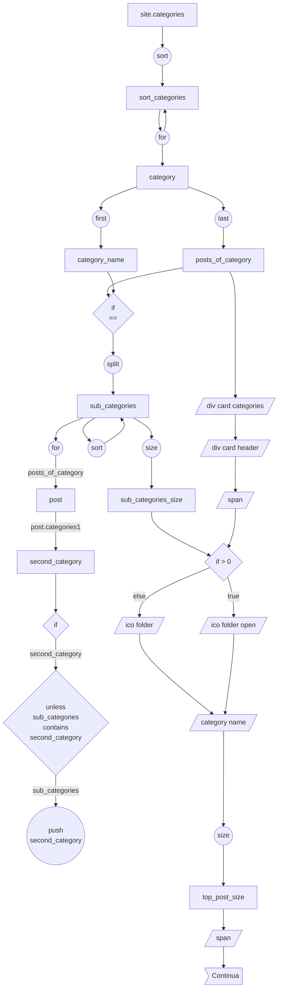

O diagrama de fluxo de dados (DFD) mapeia o fluxo de informações para qualquer processo ou sistema. Ele utiliza símbolos definidos, como retângulos, círculos e flechas, além de rótulos de textos breves, para mostrar entradas e saídas de dados, pontos de armazenamento e as rotas entre cada destino. 

## Diagrama de fluxo de dados

O seguinte diagrama, feito com o editor mermaid[^1], mapeia o fluxo de dados através das variáveis, usados para exibir uma lista na página de categorias deste site.

Simbologia:
* Retângulo = variável;
* Seta = fluxo de dados;
* Círculo = processamento;
* Triângulo = decisão;
* Retângulo inclinado = saída na página;
* retângulo com calda de peixe = nota.



## Código da página de categorias


```liquid








  
  
  

  
    

    
      
      
        
          
        
      
    

    
    


  <div class="card categories">
    <!-- top-category -->
    <div class="card-header d-flex justify-content-between hide-border-bottom"
        id="{{ HEAD_PREFIX }}{{ group_index }}">
      <span>
      
        <i class="far fa-folder-open fa-fw"></i>
      
        <i class="far fa-folder fa-fw"></i>
      
        <a href="{{ site.baseurl }}/categories/{{ category_name | slugify | url_encode }}/"
          class="ml-1 mr-2">
          {{ category_name }}
        </a>

        <!-- content count -->
        
        <span class="text-muted small font-weight-light">
          
            {{ sub_categories_size }}
            categoriescategory,
          
            {{ top_posts_size }}
            posts
        </span>
      </span>

      <!-- arrow -->
      
      <a href="#{{ LIST_PREFIX }}{{ group_index }}" data-toggle="collapse"
        aria-expanded="true" aria-label="{{ HEAD_PREFIX }}{{ group_index }}-trigger"
        class="category-trigger hide-border-bottom">
        <i class="fas fa-fw fa-angle-down"></i>
      </a>
      
      <span data-toggle="collapse" class="category-trigger hide-border-bottom disabled">
        <i class="fas fa-fw fa-angle-right"></i>
      </span>
      

    </div> <!-- .card-header -->

    <!-- Sub-categories -->
    
    <div id="{{ LIST_PREFIX }}{{ group_index }}" class="collapse show" aria-expanded="true">
      <ul class="list-group">
        
        <li class="list-group-item">
          <i class="far fa-folder fa-fw"></i>
          <a href="{{ site.baseurl }}/categories/{{ sub_category | slugify | url_encode }}/"
            class="ml-1 mr-2">{{ sub_category }}</a>
          
          <span class="text-muted small font-weight-light">{{ posts_size }}
            posts
          </span>
        </li>
        
      </ul>
    </div>
    

  </div> <!-- .card -->

    

  


```


## Referências

* O que é um diagrama de fluxo de dados?. **Lucidchard**. Disponível em <https://www.lucidchart.com/pages/pt/o-que-e-um-diagrama-de-fluxo-de-dados>. Acessado em 07 de julho de 2021.
* Simbologia de um Fluxograma. **Lucidchard**. Disponível em <https://www.lucidchart.com/pages/pt/fluxograma-simbologia>. Acessado em 07 de julho de 2021.
* Diagrama de Fluxo de Dados –DFD. **Unicamp**. Disponível em <https://www.ic.unicamp.br/~thelma/inf327/aulas-2008/Slides-Aulas/Aula1b-DFD.pdf>. Acessado em 07 de julho de 2021.
* Flowcharts - Basic Syntax. **mermaid**. Disponível em <https://mermaid-js.github.io/mermaid/#/flowchart>. Acessado em 07 de julho de 2021.

[^1]: Mermaid Live Editor. **mermaid**. Disponível em <https://mermaid-js.github.io/mermaid-live-editor>. Acessado em 07 de julho de 2021.