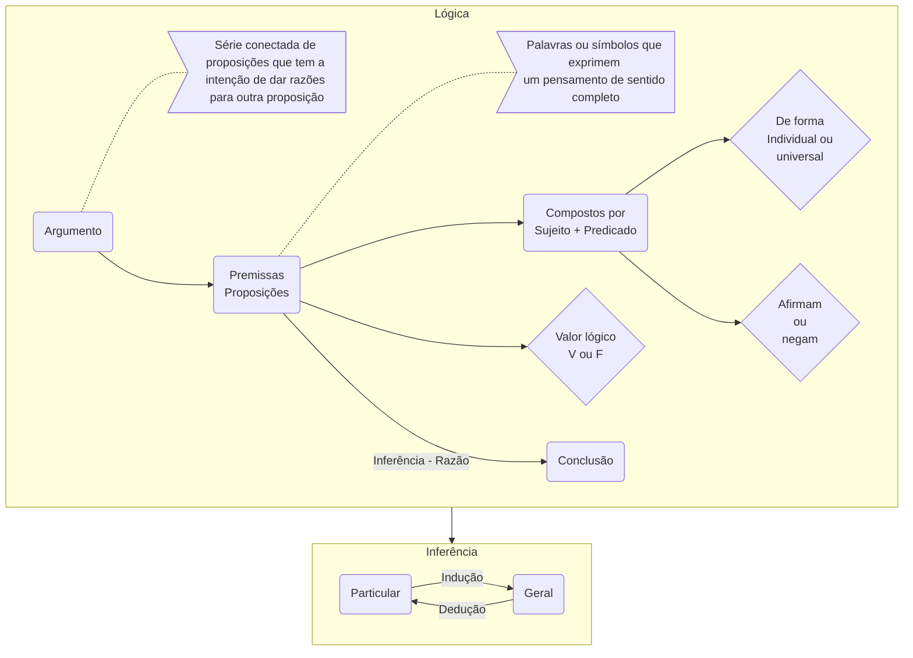

A lógica formal é a linguagem do pensamento, que pode ser desenvolvida matematicamente e na eletrônica.

```mermaid
flowchart TB
subgraph Lógica
  direction LR
  A(Argumento) -.- A1>Série conectada de proposições que tem a <br/>intenção de dar razões para outra proposição]
  A --> P(Premissas <br/>Proposições)
  P -.- P1>Palavras ou símbolos que exprimem <br/>um pensamento de sentido completo]
  P --> Su(Compostos por <br/> Sujeito + Predicado)
  Su --> In{De forma <br/> Individual ou <br/>universal}
  Su --> Af{Afirmam <br/>ou <br/>negam}
  P --> V{Valor lógico <br/>V ou F}
  P --> |Inferência - Razão| C(Conclusão)
end
subgraph Inferência
  direction LR

  Pa(Particular) --> |Indução| Ge(Geral)
  Ge --> |Dedução| Pa
end
Lógica --> Inferência

```

## Referências

 

