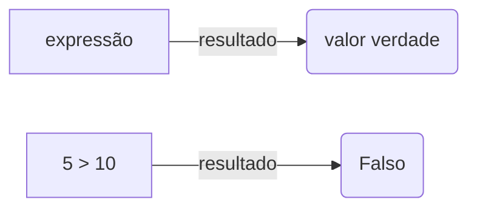
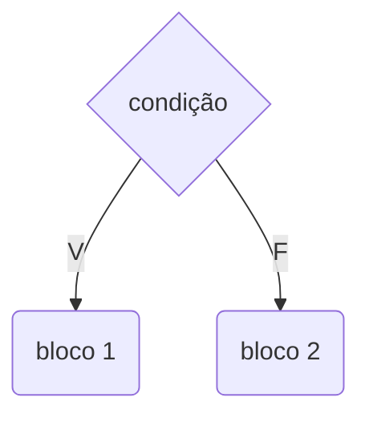
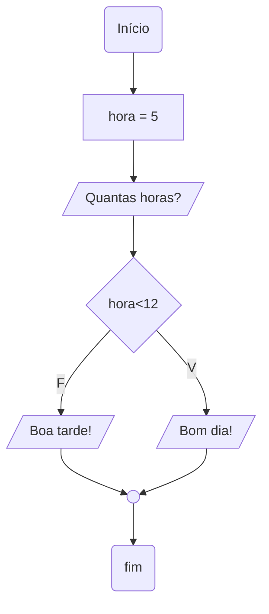

As decisões de um programa são avaliadas por expressões comparativas e lógicas, que direcionam o fluxo de execução conforme o resultado.

## Expressões comparativas
São aquelas que comparam uma coisa com outra e seu resultado dá um valor verdadeiro ou falso.



| Operador | Significado |
| :---:    | :---: |
|    >     | maior |
|    <     | menor |
|    >=    | maior ou igual |
|    <=    | menor ou igual |
|    ==    | igual |
|    !=    | diferente |

Exemplos:

| x = 5 | resultado |
| :---:    | :---: |
|  x > 0  | V |
|  x == 3 | F |
| 10 <= 30 | V |
| x != 2   | V |

## Expressões lógicas
São também expressões que avaliadas dão um valor lógico verdadeiro ou falso, elas podem ter outras expressões que utilizam operadores lógicos:

| Operador | significado |
| :---:    | :---: |
|  &&  | E |
|  \|\|  | OU |
|  !  | NÃO |

Exemplos:

| x = 5 | resultado |
| :---:    | :---: |
|  x <= 20 && x == 10  | F |
|  x <= 20 | V |
|  x == 10 | F |
|  x > 0 && x != 3 | V |
|  x > 0 | V |
|  x != 3 | V |
|  x <= 20 \|\| x == 10  | V |
| !(x == 10) | V |

### Tabela verdade

| A | B | A && B | A \|\| B | !A |
| :---: | :---: | :---: | :---: | :---: |
|  F | F | F | F | V |
|  F | V | F | V | V |
|  V | F | F | V | F |
|  V | V | V | V | F |

## Conceito
É uma estrutura de controle que permite definir que um certo bloco de comandos somente será executado dependendo de uma condição.



## Sintaxe da estrutura condicional

### Simples
```
if ( condição ) {
     comando 1 ;
     comando 2 ;
}
```
### Composta
```
if ( condição ) {
     comando 1 ;
     comando 2 ;
}
else { //senão
     comando 1 ;
     comando 2 ;
}
```
Exemplo:



```java
import java.util.Scanner;
public class Main
{
    public static void main(String[] args) {
        Scanner sc = new Scanner(System.in);
        int hora = 5;
        
        System.out.println("Quantas horas?");
        hora = sc.nextInt();
        
        if (hora < 12 ) {
            System.out.println("Bom dia!");
        }
        else {
            System.out.println("Boa tarde!");
        }
        //System.out.println("Boa noite!");
        sc.close();
    }
}
```
## Exercício
Fazer um programa para ler duas notas em seguida mostrar a nota final (com uma casa decimal), caso a nota seja menor que 12 mostrar a mensagem "REPROVADO", conforme o exemplo:

```
Digite a primeira nota: 6.0
Digite a segunda nota: 5.0
NOTA FINAL = 11.0
REPROVADO
```

Solução:

```java
import java.util.Locale;
import java.util.Scanner;

public class Main {

	public static void main(String[] args) {

	    Locale.setDefault(Locale.US);
	    Scanner sc = new Scanner(System.in);
		
	    double nota1, nota2, notafinal;

	    System.out.print("Digite a primeira nota: ");
	    nota1 = sc.nextDouble();

	    System.out.print("Digite a segunda nota: ");
	    nota2 = sc.nextDouble();

	    notafinal = nota1 + nota2;

	    System.out.printf("NOTA FINAL = %.1f\n", notafinal);

	    if (notafinal < 12.0) {
	    	System.out.println("REPROVADO");
	    }

            sc.close();
	}
}
```

## Referências

- :computer: [IDE java online](https://www.online-java.com/)
- :link: [Exemplos de códigos em Java](https://github.com/acenelio/curso-algoritmos/blob/master/java/)
- :computer: [Editor de diagramas](https://mermaid-js.github.io/mermaid-live-editor/)
- :chart_with_upwards_trend: [O que é um fluxograma](https://www.lucidchart.com/pages/pt/o-que-e-um-fluxograma)
- :page_facing_up: [Equality, Relational, and Conditional Operators - Java docs ](https://docs.oracle.com/javase/tutorial/java/nutsandbolts/op2.html)