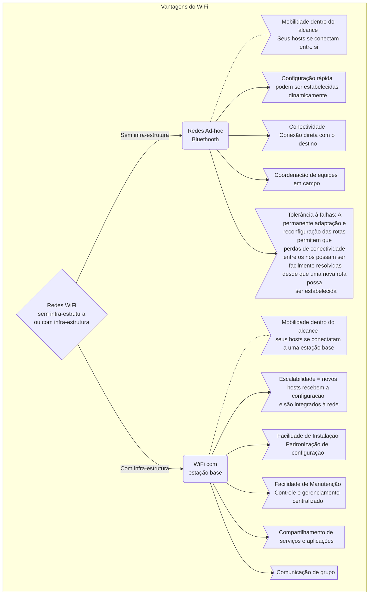

As Redes Sem Fio, ou Redes Wireless, onde wire significa cabo e less significa ausência.

## Tipos básicos de Redes Wireless

### Rede sem infra-estrutura

 

Principal topologia sem infra-estrura:

Principal arquitetura sem infra-estrura:

### Rede com infra-estrutura

Principal topologia com infra-estrutura:

Principal arquitetura com infra-estrutura:

## Desvantagens do WiFi

### Atenuação do sinal

À medida que vamos nos distanciando da fonte transmissora, o sinal também vai diminuindo ou atenuando. Um sinal fraco pode fazer com que a informação se perca ou se embaralhe com os ruídos gerados por outros elementos no ambiente.

Podem causar atenuação os obstáculos como:

- Paredes
- Montanhas
- Edifícios
- Aparelhos com blindagem

### Interferência eletromagnética

- Este problema também ocorre em redes cabeadas, mas ele causa danos maiores ainda nas redes sem fio.
- Vários outros aparelhos trabalham na mesma banda de frequência de algumas redes sem fio.
- Por exemplo, as redes Wi-Fi, que são as LANs sem fio, utilizam protocolos como o 802.11b, que utiliza para transmissão a faixa de frequência de 2,4GHz, que é a mesma usada por aparelhos de
telefones sem fio e fornos de microondas.
Assim é de se esperar um aparelho interfira no funcionamento do outro.
- Outro grande problema são outros roteadores nas proximidade transmitindo no mesmo canal de frequência.

### Custo de implantação

- Para implantar uma rede wireless deve-se considerar um custo maior que na implantação de uma rede cabeada, pois as placas e demais equipamentos com essa tecnologia são mais caros.
- Entretanto, a manutenção da rede sem fio custa bem menos tempo e dinheiro, se comparada a uma rede com fio.

Comparativo WiFi X cabeamento:

## Vantagens do WiFi

### Tabela comparativa

|                         Redes | sem infra-estrutura |                       com infra-estrutura                       |
| ----------------------------: | :-----------------: | :-------------------------------------------------------------: |
| Mobilidade dentro do alcance: |      dos hosts      |                         da estação-base                         |
|                 Configuração: |  rápida e simples   |                   padronizada e centralizada                    |
|                Conectividade: |       direta        |                     através da estação base                     |
|               Escalabilidade: |  limitada ao host   | configuração padronizada   hosts são conectados facilmente |
|                  Comunicação: |   entre os hosts    |                            em grupo                             |
|             Compartilhamento: |      arquivos       |                      serviços e aplicações                      |
|                        Custo: |        menor        |         maior   mas dependendo do tamanho da rede          |

### Gráfico comparativo

## Referência

[Apostila da disciplina de Redes de Computadores](https://educacaoprofissional.seduc.ce.gov.br/images/material_didatico/redes_de_computadores/redes_de_computadores.pdf). Secretaria da Educação do Ceará.
