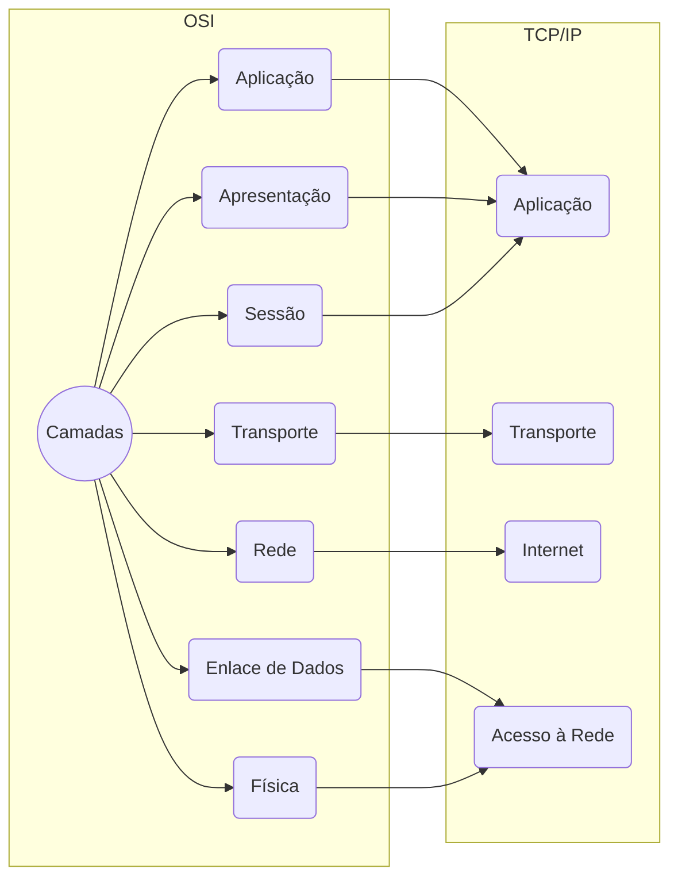
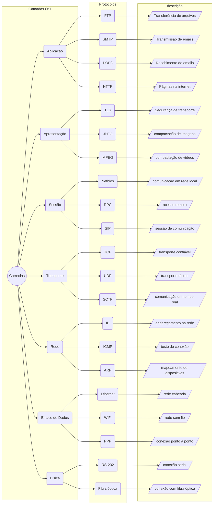

As camadas do modelo OSI (Open Systems Interconnection) são uma maneira de dividir as funções de uma rede de computadores em camadas lógicas e independentes. Cada camada do modelo OSI é responsável por uma função específica e se comunica com as camadas adjacentes através de protocolos de rede.

## O modelo OSI

O modelo OSI (Open Systems Interconnection) foi desenvolvido no final dos anos 1970 e início dos anos 1980 pela ISO (International Organization for Standardization), uma organização internacional que desenvolve padrões técnicos em várias áreas.

O objetivo do modelo OSI era fornecer uma estrutura comum para a comunicação de dados entre diferentes sistemas de computadores, independentemente do fabricante ou tecnologia utilizada. Na época, havia muitas redes de computadores proprietárias e incompatíveis, o que dificultava a comunicação entre elas.

O modelo OSI divide as funções de uma rede de computadores em sete camadas lógicas e independentes, cada uma com funções específicas e bem definidas. As camadas são:

1. Camada Física: cuida da transmissão de bits brutos por meio de um canal de comunicação.
2. Camada de Enlace de Dados: gerencia o acesso ao meio físico e a detecção e correção de erros.
3. Camada de Rede: roteia os pacotes de dados entre redes diferentes.
4. Camada de Transporte: fornece serviços de transporte de extremidade a extremidade, garantindo a entrega confiável de dados.
5. Camada de Sessão: gerencia as conexões entre sistemas e coordena as comunicações entre eles.
6. Camada de Apresentação: gerencia a forma como as informações são apresentadas ao usuário.
7. Camada de Aplicação: fornece interfaces para aplicativos de rede.

> O modelo OSI não foi amplamente adotado na prática, mas influenciou o desenvolvimento de outros modelos e padrões de redes de computadores, como o TCP/IP (Transmission Control Protocol/Internet Protocol), que é amplamente utilizado na Internet.
{: .prompt-info }

## O modelo TCP/IP

O modelo TCP/IP (Transmission Control Protocol/Internet Protocol) é outro modelo de referência para redes de computadores, desenvolvido pela DARPA (Defense Advanced Research Projects Agency) no final dos anos 1960 e início dos anos 1970 para interconectar redes de computadores militares nos Estados Unidos. O modelo TCP/IP é mais amplamente utilizado do que o modelo OSI na prática, especialmente na Internet.

O modelo TCP/IP possui quatro camadas, que diferem em número e em nomenclatura em relação ao modelo OSI. As camadas do modelo TCP/IP são:

1. Camada de Acesso à Rede (ou Camada de Interface de Rede): equivalente à camada de Enlace de Dados do modelo OSI. Gerencia o acesso ao meio físico e a detecção e correção de erros.
2. Camada de Internet: equivalente à camada de Rede do modelo OSI. Roteia os pacotes de dados entre redes diferentes e fornece serviços de fragmentação e remontagem de pacotes.
3. Camada de Transporte: equivalente à camada de Transporte do modelo OSI. Fornece serviços de transporte de extremidade a extremidade, garantindo a entrega confiável de dados. O TCP e o UDP são os protocolos mais comuns nesta camada.
4. Camada de Aplicação: equivalente às camadas de Sessão, Apresentação e Aplicação do modelo OSI combinadas. Fornece interfaces para aplicativos de rede e gerencia a forma como as informações são apresentadas ao usuário.

> Comparado ao modelo OSI, o modelo TCP/IP é mais simples e prático, e possui uma abordagem mais voltada para a implementação real de redes de computadores. Por exemplo, o modelo TCP/IP não possui uma camada específica para gerenciar conexões entre sistemas, como a camada de Sessão do modelo OSI. Além disso, o modelo TCP/IP é mais adaptável a diferentes tecnologias e arquiteturas de rede, e é amplamente utilizado na Internet e em redes locais.
{: .prompt-tip }

## Diagrama dos modelos

## Protocolos de redes

Os protocolos de rede são conjuntos de regras que governam a comunicação entre dispositivos em uma rede. Cada camada do modelo OSI é responsável por usar os protocolos de rede apropriados para realizar suas funções. Os protocolos de rede são implementados nas camadas correspondentes do modelo OSI.

Por exemplo, a camada de transporte (camada 4) é responsável por estabelecer conexões entre dispositivos em uma rede e garantir que os dados sejam entregues de forma confiável. Os protocolos de rede usados nesta camada incluem o TCP (Transmission Control Protocol) e o UDP (User Datagram Protocol).

Da mesma forma, a camada de rede (camada 3) é responsável por rotear os dados através da rede e escolher o melhor caminho para que os dados cheguem ao seu destino. Os protocolos de rede usados nesta camada incluem o IP (Internet Protocol) e o ICMP (Internet Control Message Protocol).

> Em resumo, as camadas do modelo OSI e os protocolos de rede estão intimamente relacionados, pois os protocolos são implementados em cada camada para executar as funções correspondentes.
{: .prompt-tip }

### Protocolos de Aplicação

A camada de aplicação é a camada mais alta do modelo OSI e é responsável por fornecer interfaces e serviços para os aplicativos de rede. Existem muitos protocolos diferentes na camada de aplicação, que podem ser classificados em várias categorias, como:

1. Protocolos de transferência de arquivos: permitem que os usuários transfiram arquivos entre computadores, como o FTP (File Transfer Protocol), SFTP (Secure File Transfer Protocol) e TFTP (Trivial File Transfer Protocol).
2. Protocolos de correio eletrônico: permitem que os usuários enviem e recebam e-mails, como o SMTP (Simple Mail Transfer Protocol) e o POP3 (Post Office Protocol version 3).
3. Protocolos de mensagens instantâneas: permitem que os usuários troquem mensagens em tempo real, como o IRC (Internet Relay Chat) e o XMPP (Extensible Messaging and Presence Protocol).
4. Protocolos de acesso remoto: permitem que os usuários acessem computadores ou redes remotas, como o Telnet e o SSH (Secure Shell).
5. Protocolos de acesso à web: permitem que os usuários acessem e interajam com recursos da Web, como o HTTP (Hypertext Transfer Protocol) e o HTTPS (HTTP Secure).
6. Protocolos de serviços de diretório: permitem que os usuários consultem informações de diretório, como o LDAP (Lightweight Directory Access Protocol).
7. Protocolos de voz e vídeo: permitem que os usuários realizem chamadas de voz e vídeo em tempo real, como o SIP (Session Initiation Protocol) e o H.323.

> Esses são apenas alguns exemplos de protocolos de aplicação existentes. Cada protocolo fornece serviços específicos que são utilizados por diferentes aplicativos de rede.
{: .prompt-info }

### Protocolos de apresentação

A camada de apresentação é a sexta camada do modelo OSI e é responsável por garantir que as informações sejam apresentadas de forma adequada ao usuário. Essa camada lida com questões como a codificação e decodificação de dados, compressão e criptografia.

Alguns dos protocolos comumente associados à camada de apresentação incluem:

1. TLS (Transport Layer Security): é um protocolo de criptografia usado para proteger a privacidade dos dados em redes de computadores, fornecendo autenticação, confidencialidade e integridade dos dados transmitidos.
2. SSL (Secure Sockets Layer): é um protocolo de criptografia que foi substituído pelo TLS, mas ainda é usado em algumas aplicações legadas. É comumente usado em servidores web para proteger a comunicação entre um navegador e um servidor.
3. JPEG (Joint Photographic Experts Group): é um padrão de compressão de imagem usado para reduzir o tamanho de imagens digitais sem perder muita qualidade. É comumente usado em imagens enviadas por e-mail ou exibidas em sites da Web.
4. MPEG (Moving Picture Experts Group): é um padrão de compressão de vídeo usado para reduzir o tamanho de vídeos digitais. É usado em aplicativos de vídeo em streaming e em transmissões de televisão digital.
5. ASCII (American Standard Code for Information Interchange): é um conjunto de códigos que representa caracteres alfanuméricos em computadores. É usado para garantir que o texto seja exibido corretamente em diferentes sistemas operacionais e aplicativos.

> Esses são apenas alguns exemplos de protocolos associados à camada de apresentação. Cada protocolo é projetado para lidar com uma tarefa específica relacionada à apresentação de dados para o usuário.
{: .prompt-info }

### Protocolos de Sessão

A camada de sessão é a quinta camada do modelo OSI e é responsável por estabelecer, gerenciar e encerrar sessões entre aplicativos em redes de computadores. Essa camada lida com questões como controle de diálogo, sincronização e gerenciamento de tokens de autenticação.

Alguns dos protocolos comumente associados à camada de sessão incluem:

1. NetBIOS (Network Basic Input/Output System): é um protocolo usado para permitir que computadores em uma rede local se comuniquem entre si. Ele oferece suporte à resolução de nomes de computador, compartilhamento de arquivos e impressoras e outros serviços de rede.
2. RPC (Remote Procedure Call): é um protocolo que permite que um programa em um computador execute uma função em outro computador sem que o usuário precise saber como os dois computadores estão conectados. É comumente usado em aplicativos distribuídos e em sistemas cliente-servidor.
3. NFS (Network File System): é um protocolo usado para compartilhar arquivos em uma rede de computadores. Ele permite que um computador acesse arquivos em outro computador como se estivessem localmente armazenados.
4. SQL (Structured Query Language): é uma linguagem de programação usada para gerenciar bancos de dados relacionais. É comumente usado em aplicativos de gerenciamento de banco de dados em servidores de banco de dados.
5. SIP (Session Initiation Protocol): é um protocolo usado para estabelecer e gerenciar sessões de comunicação em tempo real, como chamadas de voz e vídeo pela Internet.

> Esses são apenas alguns exemplos de protocolos associados à camada de sessão. Cada protocolo é projetado para lidar com uma tarefa específica relacionada à comunicação entre aplicativos em uma rede de computadores.
{: .prompt-info }

### Protocolos de transporte

A camada de transporte é a quarta camada do modelo OSI e é responsável por fornecer serviços de comunicação fim a fim, incluindo a segmentação de dados em unidades menores para transmissão, controle de fluxo, controle de erro e estabelecimento de conexão.

Alguns dos protocolos comumente associados à camada de transporte incluem:

1. TCP (Transmission Control Protocol): é um protocolo confiável, orientado à conexão e baseado em fluxo que fornece uma comunicação fim a fim confiável e ordenada de dados entre aplicativos. É amplamente utilizado na Internet para transferência de arquivos, e-mail e navegação na Web.
2. UDP (User Datagram Protocol): é um protocolo não confiável, não orientado à conexão e baseado em datagrama que é usado para aplicações em que a perda de alguns dados não é crítica, como vídeo em tempo real e jogos online.
3. SCTP (Stream Control Transmission Protocol): é um protocolo orientado à conexão e baseado em fluxo semelhante ao TCP, mas projetado para fornecer maior confiabilidade e segurança para aplicações em tempo real, como telefonia IP e videoconferência.
4. DCCP (Datagram Congestion Control Protocol): é um protocolo orientado à conexão e baseado em datagrama projetado para fornecer comunicação de baixa latência e congestionamento controlado para aplicações como streaming de vídeo e voz.
5. SPX (Sequenced Packet Exchange): é um protocolo de transporte usado em redes Novell NetWare. Ele fornece um serviço de comunicação fim a fim confiável e ordenado de dados entre aplicativos em uma rede local.

> Esses são apenas alguns exemplos de protocolos associados à camada de transporte. Cada protocolo é projetado para lidar com uma tarefa específica relacionada à transferência de dados entre aplicativos em uma rede de computadores.
{: .prompt-info }

### Protocolos da camada de redes

A camada de rede é a terceira camada do modelo OSI e é responsável por encaminhar dados de um nó para outro na rede. Essa camada lida com questões como roteamento de pacotes, endereçamento e controle de congestionamento.

Alguns dos protocolos comumente associados à camada de rede incluem:

1. IP (Internet Protocol): é o protocolo principal da camada de rede da Internet. Ele fornece um endereço IP único para cada dispositivo na rede e permite que pacotes de dados sejam encaminhados de um nó para outro.
2. ICMP (Internet Control Message Protocol): é um protocolo usado para enviar mensagens de erro e informações de controle de rede entre dispositivos IP.
3. ARP (Address Resolution Protocol): é um protocolo usado para mapear um endereço IP para um endereço MAC (Media Access Control) em uma rede local.
4. RARP (Reverse Address Resolution Protocol): é um protocolo usado para mapear um endereço MAC para um endereço IP em uma rede local.
5. OSPF (Open Shortest Path First): é um protocolo de roteamento dinâmico usado para determinar a melhor rota para enviar pacotes em uma rede IP. Ele usa um algoritmo de caminho mais curto para determinar as rotas mais eficientes para os pacotes de dados.

> Esses são apenas alguns exemplos de protocolos associados à camada de rede. Cada protocolo é projetado para lidar com uma tarefa específica relacionada à transferência de dados entre nós na rede.
{: .prompt-info }

### Protocolos de Enlace de dados

A camada de enlace de dados é a segunda camada do modelo OSI e é responsável por transmitir dados entre dispositivos em uma rede local. Essa camada lida com questões como controle de acesso ao meio, detecção de erros, divisão de quadros e endereçamento físico.

Alguns dos protocolos comumente associados à camada de enlace incluem:

1. Ethernet: é um protocolo de rede com fio que é amplamente usado em redes locais (LANs). Ele define como os dados são transmitidos na rede e fornece um endereço físico exclusivo para cada dispositivo conectado à rede.
2. Wi-Fi: é um protocolo de rede sem fio que é usado em redes locais sem fio (WLANs). Ele define como os dados são transmitidos sem fio na rede e fornece um endereço físico exclusivo para cada dispositivo conectado à rede.
3. PPP (Point-to-Point Protocol): é um protocolo usado para estabelecer uma conexão entre dois dispositivos de rede, geralmente um computador e um servidor ISP (Internet Service Provider). Ele é frequentemente usado para conexões de Internet discadas.
4. HDLC (High-Level Data Link Control): é um protocolo usado em redes de longa distância (WANs) para fornecer comunicação de dados confiável e eficiente.
5. Token Ring: é um protocolo de rede local que usa um token para controlar o acesso ao meio e garantir que apenas um dispositivo transmita dados de cada vez.

> Esses são apenas alguns exemplos de protocolos associados à camada de enlace de dados. Cada protocolo é projetado para lidar com uma tarefa específica relacionada à transmissão de dados entre dispositivos em uma rede local ou de longa distância.
{: .prompt-info }

### Protocolos da camada Física

A camada física é a camada mais baixa do modelo OSI e é responsável por transmitir bits brutos de dados de um dispositivo para outro na rede. Essa camada lida com questões como a interface com o meio físico, a codificação de dados e a taxa de transmissão.

Alguns dos protocolos comumente associados à camada física incluem:

1. Ethernet: como mencionado anteriormente, o protocolo Ethernet não apenas define como os dados são transmitidos na camada de enlace, mas também especifica os padrões físicos de cabeamento, conectores e sinais elétricos usados para transmitir os dados.
2. Wi-Fi: como mencionado anteriormente, o protocolo Wi-Fi também especifica padrões físicos de comunicação sem fio, incluindo frequências de rádio, modulação de sinais e técnicas de antena.
3. RS-232: é um protocolo usado para comunicação serial entre dispositivos, como computadores e modems. Ele especifica os padrões físicos para cabos e conectores usados na comunicação serial.
4. V.35: é um protocolo de comunicação serial usado em redes de longa distância. Ele define os padrões físicos para cabos e conectores usados para transmissão de dados.
5. Fibra óptica: é um tipo de tecnologia de transmissão de dados que usa fibras ópticas para transmitir sinais de luz em vez de sinais elétricos. Existem vários padrões físicos associados à tecnologia de fibra óptica, incluindo o padrão ST, SC, LC e MTRJ.

> Esses são apenas alguns exemplos de protocolos associados à camada física. Cada protocolo é projetado para lidar com uma tarefa específica relacionada à transmissão de bits brutos de dados de um dispositivo para outro na rede.
{: .prompt-info }

### Diagrama do modelo OSI e protocolos

## Referências

- [Apostila de Meios de Comunicação de Dados]({{site.data.references.apostilas.redes[0].link}})
