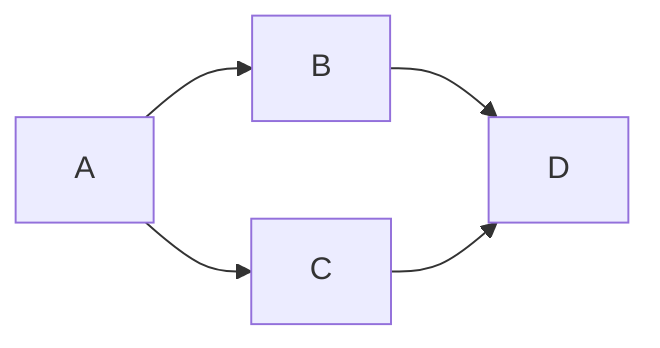
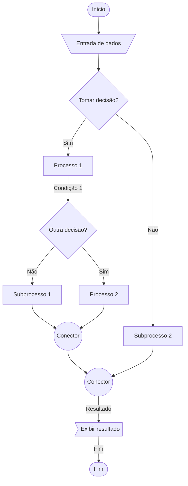

Fluxograma é uma maneira de representar um processo por meio de um desenho, ou seja, é uma forma simples e fácil de identificar o fluxo com que as atividades acontecem.

## Tipos de fluxogramas

- Diagrama de Blocos
- Processo Simples
- Funcional
- Vertical

Para saber mais acesse: [5 passos para criacao de um fluxograma](https://blog.zeev.it/5-passos-para-criacao-de-um-fluxograma/)

## Como fazer fluxogramas

Para criar diagramas de fluxo ou fluxogramas, primeiro é preciso um editor, como o Mermaid, em seguida seguir os seguintes passos:

Escolha uma plataforma de edição de texto ou código que suporte a sintaxe do Mermaid. Algumas opções populares incluem VS Code, Atom, Sublime Text, ou mesmo o [editor online do Mermaid](https://mermaid.live/).

Comece definindo o tipo de gráfico que você deseja criar, utilizando a sintaxe apropriada do Mermaid. Por exemplo, para criar um diagrama de fluxo, você pode começar com o seguinte código:

```plaintext
graph LR;
  A-->B;
  A-->C;
  B-->D;
  C-->D;
```

Resultado:



Este código cria um diagrama de fluxo básico com quatro nós (A, B, C e D) e quatro setas conectando-os.

Personalize seu gráfico adicionando nós adicionais, alterando as cores ou estilos, adicionando texto descritivo e ajustando o layout. Existem muitas opções de personalização disponíveis na sintaxe do Mermaid, e você pode encontrar uma lista completa de opções na documentação oficial.

Depois de personalizar o seu gráfico, salve-o como um arquivo de imagem ou insira-o diretamente em seu documento ou aplicativo usando a sintaxe apropriada. Por exemplo, para inserir o gráfico em um documento HTML, você pode usar o seguinte código:

```html
<html>
<head>
  <script src="https://cdn.jsdelivr.net/npm/mermaid@8.9.3/dist/mermaid.min.js"></script>
  <script>mermaid.initialize({startOnLoad:true});</script>
</head>
<body>
  <div class="mermaid">
    graph LR;
    A-->B;
    A-->C;
    B-->D;
    C-->D;
  </div>
</body>
</html>
```

Este código carrega a biblioteca Mermaid, inicializa o gráfico e o exibe em um elemento div com a classe mermaid.

Com esses passos simples, você pode criar um fluxograma ou diagrama de fluxo utilizando a sintaxe do Mermaid.

## Símbolos do fluxograma

Exemplo básico de um diagrama de fluxo com Mermaid que exiba todos os elementos comuns do fluxograma:

```plaintext
graph TD;
    Inicio([Inicio]) --> Entrada[\Entrada de dados/];
    Entrada --> Decisao{Tomar decisão?};
    Decisao -- Sim --> Processo[Processo 1];
    Processo -- Condição 1 --> Decisao2{Outra decisão?};
    Decisao2 -- Sim --> Processo2[Processo 2];
    Decisao2 -- Não --> Subprocesso[Subprocesso 1];
    Subprocesso --> Processo3((Conector));
    Processo2 --> Processo3;
    Processo3 --> DecisaoFinal((Conector));
    DecisaoFinal -- Resultado --> Exibir>Exibir resultado];
    Exibir -- Fim --> Fim([Fim]);
    Decisao -- Não --> Subprocesso2[Subprocesso 2];
    Subprocesso2 --> DecisaoFinal;

```

Resultado:



Nesse exemplo, temos os seguintes elementos do fluxograma:

- Início: Representado pelo nó Inicio.
- Entrada: Representa uma entrada de dados pelo usuário.
- Decisão: Representado pelo nó Decisao com uma seta saindo para Processo 1 quando a resposta é sim, e para Subprocesso 2 quando a resposta é não.
- Processo: Representado pelo nó Processo 1, Processo 2, Processo 3.
- Condição: Representada pela seta com texto Condição 1.
- Subprocesso: Representado pelo nó Subprocesso 1 e Subprocesso 2.
- Exibir resultado: mostra o resultado na saída padrão.
- Conclusão: Representado pelo nó DecisaoFinal com uma seta saindo para Fim quando a decisão é tomada.

> Lembre-se de que a sintaxe do Mermaid pode ser personalizada para atender às suas necessidades específicas de fluxograma. Portanto, você pode alterar as cores, formas, tamanhos e estilos dos nós e das setas, bem como adicionar texto descritivo e ajustar o layout para tornar seu diagrama de fluxo mais claro e legível.
{: .prompt-info }

[Veja a lista completa de símbolos aqui!](https://blog.zeev.it/wp-content/uploads/2021/01/OD_SML_info.png)

## Editores de diagramas

- [Mermaid](https://mermaid.live/)
- [Manual de Diagramas Mermaid](https://mermaid.js.org/syntax/flowchart.html)
- [Plantuml](https://plantuml.com/activity-diagram-beta)
- [Draw.io](https://app.diagrams.net/)
- [Lucidchard](https://www.lucidchart.com/pages/pt/exemplos/fluxograma-online)
