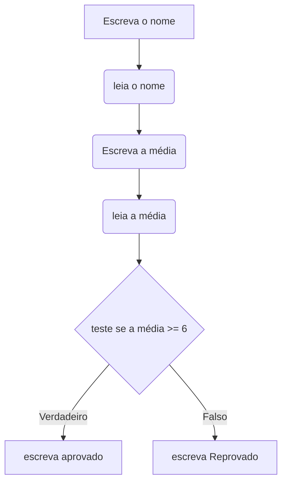

Exercícios com condicionais

1. Faça um algoritmo para ler dois números e imprimir o maior, o menor ou então dizer se são iguais.
2. Faça um algoritmo para ler um número inteiro e dizer se o número lido é par ou impar.
3. Faça um algoritmo para ler dois números A e B e dizer se A é divisível por B.
4. Faça um algoritmo para ler dois números e imprimi-los em ordem crescente.
5. Faça um algoritmo para ler três números e imprimir o maior.

DESAFIO

 01- Faça um algoritmo para ler três números e imprimir se estes podem ou não formar um triângulo.

 Observação  - Para formar os lados de um triângulo cada um dos valores tem que ser menor que a soma dos outros dois.

 02- Faça um algoritmo para ler três números e se estes poderem formar um triângulo dizer se o triângulo é "EQUILÁTERO", "ISÓCELES" OU "ESCALENO".

 03- Faça um algoritmo que leia as três notas, as faltas e o nome de um aluno e imprima sua situação. ( "APROVADO", "REPROVADO POR FALTA" ou "REPROVADO POR MÉDIA" )

 Observação  - A média para aprovação é 5.0 e o limite de faltas é 17.

## Exemplos

Construa um algoritmo para testar se um número é maior, igual ou menor que 100.

```plaintext
programa {
  inteiro numero
  funcao inicio() {
    escreva("Digite um numero: ")
    leia(numero)
    escreva("O número digitado é ")
    se (numero < 100) {
      escreva("menor")
    } senao {
      se (numero == 100) {
      escreva("igual")
      } senao {
         escreva("maior")
      }
    }
    escreva(" que 100! O número é: " + numero)
  }
}
```

### Teste de resto

```plaintext
programa {
  funcao inicio() {
    real NUM1, NUM2, RESTODIVISAO
			escreva("Entre com o primeiro número: ")
      leia (NUM1)
      escreva("Entre com o segundo número: ")
      leia (NUM2)
			RESTODIVISAO = NUM1 % NUM2
      se (RESTODIVISAO == 0)	{
        escreva("A divisão do ", NUM1, " pelo ", NUM2, " é exata")
      }		
			   
      escreva("A divisão do ", NUM1, " pelo ", NUM2, " não é exata")
  }
```

Melhorando o código

```plaintext
programa {
  funcao inicio() {
    real NUM1, NUM2, RESTODIVISAO
			escreva("Entre com o primeiro número: ")
      leia (NUM1)
      escreva("Entre com o segundo número: ")
      leia (NUM2)
			RESTODIVISAO = NUM1 % NUM2
      escreva("A divisão do ", NUM1, " pelo ", NUM2)
      se (RESTODIVISAO == 0)	{
        escreva(" é exata")
      }	senao {
        escreva(" não é exata")
      }	
  }
}
```

Evoluindo o código

```plaintext
programa {
  funcao inicio() {
    real NUM1, NUM2, RESTODIVISAO
			escreva("Entre com o primeiro número: ")
      leia (NUM1)
      escreva("Entre com o segundo número: ")
      leia (NUM2)
			RESTODIVISAO = NUM1 % NUM2
      escreva("A divisão do ", NUM1, " pelo ", NUM2)
      se (nao(RESTODIVISAO == 0))	{
        escreva(" não")
      }
      escreva(" é exata")
  }
}
```

### Teste condicional de média

Faça um algoritmo para ler o nome de um aluno e sua média final. O resultado desse algoritmo deve ser uma mensagem informando se o aluno foi aprovado ou não. O critério de aprovação é ter média igual ou superior a 6,0....

Xavier, Gley Fabiano Cardoso
Lógica de programação
E-book. Disponível em: [https://bibliotecadigitalsenac.com.br/?from=%3FcontentInfo%3D1306#/legacy/epub/1306](https://bibliotecadigitalsenac.com.br/?from=%3FcontentInfo%3D1306#/legacy/epub/1306)
Acesso em 31/03/2023



Em Portugol

```plaintext
programa {
  funcao inicio() {
    cadeia nome
    real media
    escreva("Entre com o nome: ")
    leia (nome)
    escreva("Entre com a média: ")
    leia (media)
    se (media >= 6) {
      escreva("O aluno ", nome, " foi aprovado com a média: ", media)
    } senao {
      escreva("O aluno ", nome, " foi reprovado com a média: ", media)
    }
  }
}
```

Melhorando o código

```plaintext
programa {
  funcao inicio() {
    cadeia nome
    real media
    escreva("Entre com o nome: ")
    leia (nome)
    escreva("Entre com a média: ")
    leia (media)
    escreva("O aluno ", nome, " foi ")
    se (media >= 6) {
      escreva("aprovado ")
    } senao {
      escreva("reprovado ")
    }
    escreva("com a média: ", media)
  }
}
```

Encadeamento de comandos se:

Nos problemas com vários testes/comparações, portanto, com vários comandos se, é necessário encadear os comandos, inserindo um dentro do outro, para aplicar e verificar todas as soluções possíveis. Veja o exemplo a seguir.

Problema:

Faça um algoritmo para ler duas notas de um aluno. Se a média aritmética das notas for maior que 6,0, deve aparecer a mensagem "Média superior à média mínima (6,0)"; se for igual a 6,0, "Média igual à média mínima (6,0)"; se for me...

```plaintext
programa {
  funcao inicio() {
    cadeia nome
    real media
    escreva("Entre com o nome: ")
    leia (nome)
    escreva("Entre com a média: ")
    leia (media)
    escreva("O aluno ", nome, " tem média ")
    se (media > 6) {
      escreva("superior a média mínima ")
    } senao {
      se (media == 6) {
        escreva("igual a média mínima")
      } senao {
        escreva("inferior a média mínima ")
      }      
    }
  }
}
```

## Referências

- [Portugol Webstudio editor online](https://dgadelha.github.io/Portugol-Webstudio/)
