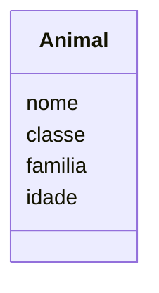
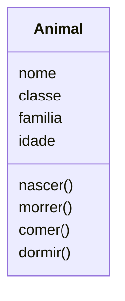
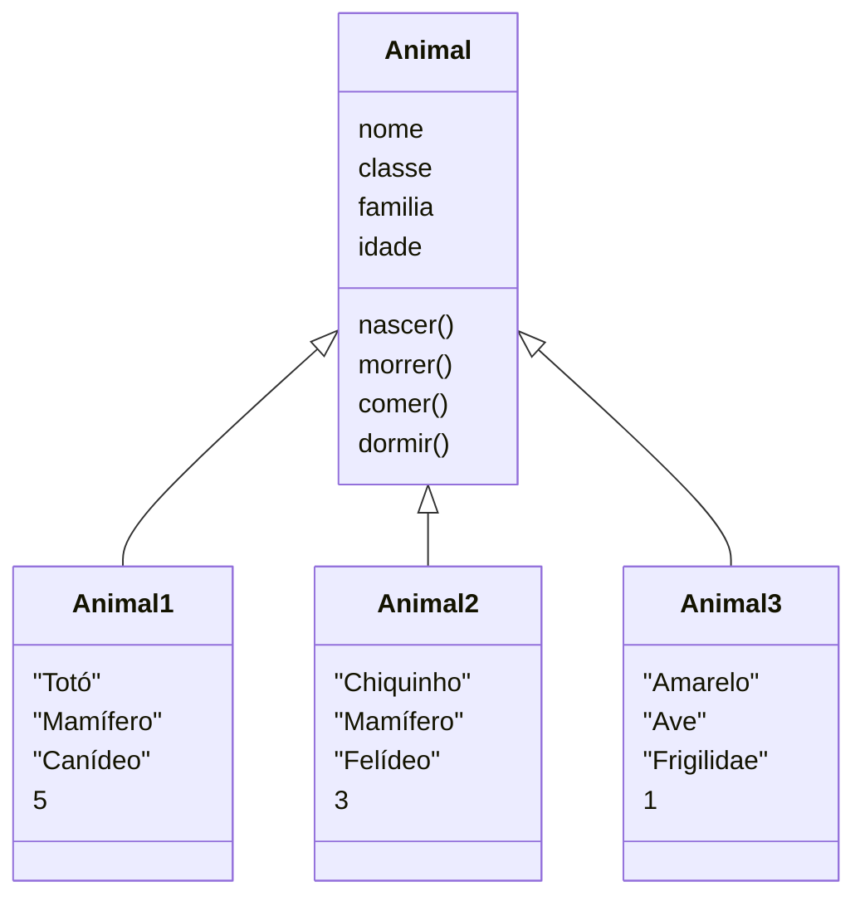
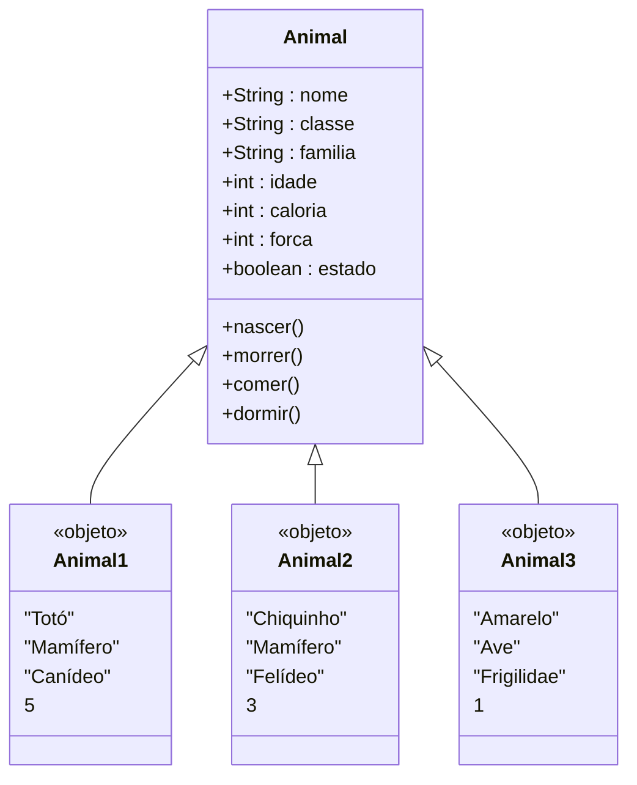

Suponha que você tivesse de criar um jogo de Bicho Virtual (também chamado de Virtual PET ou Tamagotchi). Neste jogo, o jogador terá um animal e deverá fazer com ele várias ações com o objetivo de criá-lo por um determinado tempo. O objetivo é não deixá-lo morrer de fome, cansaço ou sede.

Para construir o jogo usando OO, é preciso imaginar. Imaginar genericamente um animal e não somente um tipo de animal ou apenas o seu animal de estimação.

Pense então nas características principais que gostaria que ele tivesse. Com quais informações você poderia descrever esse animal genérico? Provavelmente seriam: nome, classe, família, idade, cor, tipo de pelagem, cor dos olhos, etc.
Em seguida, determine quais ações seriam executadas por ele. Imagine-se criando situações para o cotidiano desse animal: como nascerá, como morrerá, o que comerá, de que maneira correrá, como dormirá, entre outras situações.

## Diagrama UML de classe

Essas características devem estar presentes na classe e são chamadas de Atributos. Veja o diagrama a seguir que representa a classe Animal, assim como alguns atributos:



Quando se fala em comportamento na definição de classe, está se referindo a métodos, ou seja, às ações/operações.
No Virtual PET foram escolhidas algumas ações, como: nascer, morrer, comer, correr e dormir. Veja no diagrama a seguir como ficam a classe e os objetos com a inserção dos métodos:



## Criando objetos

Todo objeto criado a partir da classe Animal deve ter os atributos descritos no diagrama. Porém, os conteúdos desses atributos presentes nos objetos é que os distinguem entre si. Esses conteúdos são chamados de estados, pois cada objeto criado a partir da classe terá suas características próprias.

Por exemplo: cria 3 objetos a partir da classe animal.

Vamos criar um cachorro, um gato e um passarinho conforme o diagrama:

Diagrama de objetos:



## Implementando com Java

Para implementa com a linguagem de programação precisamos implementar os métodos com suas respectivas funcionalidades:

Os atributos servirão para indicar a saúde do animal. Isto é, ele somente fará algo se estiver vivo (atributo estado), possuir a quantidade de calorias necessárias (atributo caloria) e tiver força para isso (atributo força), como todo animal precisa.

Precisamos especificar os tipos das variáveis para as propriedades da classe animal:

```plaintext
classe ANIMAL
  NOME, CLASSE, FAMILIA : literal
  IDADE,CALORIA,FORCA: numérico
  ESTADO:lógico
```

Os métodos:

- NASCER: método que pergunta os dados do animal: nome, classe e família, coloca-o em estado vivo, insere uma quantidade de calorias e força e insere 0 como estado do atributo idade.
- MORRER: método que coloca o objeto em estado morto.
- COMER: método que, caso o animal não esteja cheio e/ou morto, insere determinada quantidade de calorias e retira uma quantidade de força por ter realizado essa ação.
- CORRER: método que retira determinada quantidade de calorias e uma quantidade de força por ter realizado essa ação, caso o animal não esteja morto ou exausto.
- DORMIR: método que retira determinada quantidade de calorias e insere uma quantidade de força, caso o animal não esteja morto.

Atualizando o diagrama de classe:



Exemplo inicial de implementação:

```java
public class Animal {

    public String Nome;
    public String Classe;
    public String Familia;
    public int Idade;    
    public int Caloria;
    public int Forca;
    public boolean Estado;

    public static void main(String[] args) {
        Animal animal1 = new Animal();
        Animal animal2 = new Animal();
        Animal animal3 = new Animal();
        animal1.Nome = "Totó";
        animal1.Classe = "mamífero";
        animal1.Familia = "Canídeo";
        animal1.Idade = 5;
        animal2.Nome = "Chiquinho";
        animal2.Classe = "mamífero";
        animal2.Familia = "Felídio";
        animal2.Idade = 3;
        animal3.Nome = "Amarelo";
        animal3.Classe = "ave";
        animal3.Familia = "Fringilidae";
        animal3.Idade = 1;
        System.out.println("Nome do animal 1: " + animal1.Nome);
        System.out.println("Classe: " + animal1.Classe);
        System.out.println("Familia: " + animal1.Familia);
        System.out.println("Idade: " + animal1.Idade);
        System.out.println("Nome do animal 2: " + animal2.Nome);
        System.out.println("Classe: " + animal2.Classe);
        System.out.println("Familia: " + animal2.Familia);
        System.out.println("Idade: " + animal2.Idade);
        System.out.println("Nome do animal 3: " + animal3.Nome);
        System.out.println("Classe: " + animal3.Classe);
        System.out.println("Familia: " + animal3.Familia);
        System.out.println("Idade: " + animal3.Idade);
        System.out.println("métodos do animal: ");
        animal1.nascer();
        animal3.morrer();
        animal2.correr();
        animal1.comer();
    }

    public void nascer(String Nome, String Classe, String Familia, int Idade,    
        boolean Estado, int Caloria, int Forca) {
        
        this.Nome = Nome;
        this.Classe = Classe;
        this.Familia = Familia;
        this.Idade = Idade;
        this.Estado = Estado;
        this.Caloria = Caloria;
        this.Forca = Forca;
        
        System.out.println("O " + Nome + " nasceu");
    }

    public String morrer() {        
        return ("O " + Nome + " morreu");
    }

    public void comer() {
        System.out.println("O " + Nome + " comeu");
    }

    public void correr() {
        System.out.println("O " + Nome + " corre");
    }

    public void dormir() {
        System.out.println("O " + Nome + " dorme");
    }

    public void nascer() {
    }
}
```

Como atividade as funcionalidades devem ser implementadas, acompanhe o progresso no repositório do [Github](https://github.com/jocile/programador-senac/blob/main/poo/).

## Referências

Xavier, Gley Fabiano Cardoso
Lógica de programação cap. 10. pg. 247.
E-book. Disponível em: [https://bibliotecadigitalsenac.com.br/?from=%3FcontentInfo%3D1306#/legacy/epub/1306](https://bibliotecadigitalsenac.com.br/?from=%3FcontentInfo%3D1306#/legacy/epub/1306)
Acesso em 11/05/2023

[Exercicios com classes em java]()
