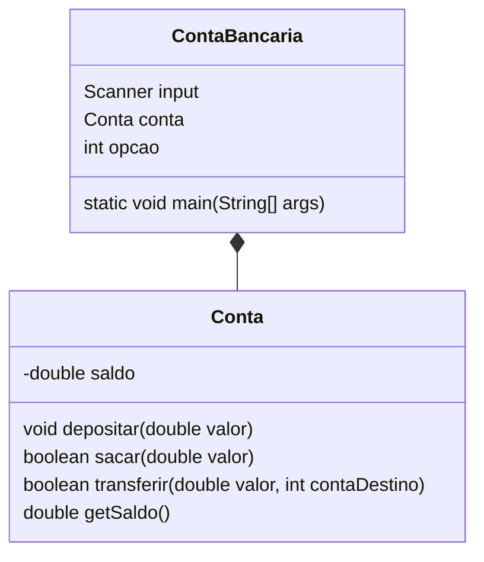

Criar um aplicativo em Java que represente um sistema de controle de contas correntes bancárias de um correntista.

- Conta: porque seriam movimentadas uma ou várias contas. Para isso, serão necessários os seguintes dados (número, banco, saldo, etc.) para realizar operações de crédito, débito, entre outras operações bancárias nas contas.
- Banco: porque poderia ter um ou mais bancos a quem essas contas pertencessem.
Correntista: porque toda conta pertence a uma pessoa no mundo real e geralmente têm atrelado a elas seus dados (nome, endereço, fone, documento de identidade, CPF, etc.).

## Programação estruturada

Exemplo de um programa de conta de banco, com depósito, saque e transferência

```java
import java.util.Scanner;

public class ContaBancaria {

    public static void main(String[] args) {
        Scanner input = new Scanner(System.in);
        
        int opcao;
        double saldo = 0;
        
        do {
            System.out.println("Escolha uma opção:");
            System.out.println("1 - Depósito");
            System.out.println("2 - Saque");
            System.out.println("3 - Transferência");
            System.out.println("4 - Saldo");
            System.out.println("0 - Sair");
            
            opcao = input.nextInt();
            
            switch(opcao) {
                case 1:
                    System.out.print("Digite o valor do depósito: ");
                    double deposito = input.nextDouble();
                    saldo += deposito;
                    break;
                case 2:
                    System.out.print("Digite o valor do saque: ");
                    double saque = input.nextDouble();
                    if (saque <= saldo) {
                        saldo -= saque;
                    } else {
                        System.out.println("Saldo insuficiente");
                    }
                    break;
                case 3:
                    System.out.print("Digite o valor da transferência: ");
                    double transferencia = input.nextDouble();
                    if (transferencia <= saldo) {
                        System.out.print("Digite o número da conta de destino: ");
                        int contaDestino = input.nextInt();
                        System.out.println("Transferência realizada com sucesso");
                        saldo -= transferencia;
                    } else {
                        System.out.println("Saldo insuficiente");
                    }
                    break;
                case 4:
                    System.out.println("Saldo: " + saldo);
                    break;
                case 0:
                    System.out.println("Saindo...");
                    break;
                default:
                    System.out.println("Opção inválida");
            }
            
            System.out.println();
            
        } while (opcao != 0);
    }

}
```

## Usando funções

Segue abaixo um exemplo de programa de conta bancária em Java com a classe principal usando funções:

```java
import java.util.Scanner;

public class ContaBancaria {

    public static void main(String[] args) {
        Scanner input = new Scanner(System.in);
        
        double saldo = 0.0;
        
        int opcao;
        
        do {
            System.out.println("Escolha uma opção:");
            System.out.println("1 - Depósito");
            System.out.println("2 - Saque");
            System.out.println("3 - Transferência");
            System.out.println("4 - Saldo");
            System.out.println("0 - Sair");
            
            opcao = input.nextInt();
            
            switch(opcao) {
                case 1:
                    System.out.print("Digite o valor do depósito: ");
                    double deposito = input.nextDouble();
                    saldo = depositar(saldo, deposito);
                    break;
                case 2:
                    System.out.print("Digite o valor do saque: ");
                    double saque = input.nextDouble();
                    saldo = sacar(saldo, saque);
                    break;
                case 3:
                    System.out.print("Digite o valor da transferência: ");
                    double transferencia = input.nextDouble();
                    System.out.print("Digite o número da conta de destino: ");
                    int contaDestino = input.nextInt();
                    saldo = transferir(saldo, transferencia, contaDestino);
                    break;
                case 4:
                    System.out.println("Saldo: " + saldo);
                    break;
                case 0:
                    System.out.println("Saindo...");
                    break;
                default:
                    System.out.println("Opção inválida");
            }
            
            System.out.println();
            
        } while (opcao != 0);
    }
    
    public static double depositar(double saldo, double valor) {
        return saldo + valor;
    }
    
    public static double sacar(double saldo, double valor) {
        if (valor <= saldo) {
            return saldo - valor;
        } else {
            System.out.println("Saldo insuficiente");
            return saldo;
        }
    }
    
    public static double transferir(double saldo, double valor, int contaDestino) {
        if (valor <= saldo) {
            // Lógica para transferência
            return saldo - valor;
        } else {
            System.out.println("Saldo insuficiente");
            return saldo;
        }
    }

}
```

Neste exemplo, as operações de depósito, saque e transferência foram transformadas em funções que recebem o saldo atual e os valores necessários para realizar as operações e retornam o novo saldo após a operação. Na classe principal, as funções são chamadas dentro do switch-case correspondente a cada operação. O objeto da classe Conta não é mais necessário neste exemplo, uma vez que todas as operações são realizadas por meio das funções.

## Usando Programação orientada a objetos

### Diagrama UML de classe

Essas características devem estar presentes na classe e são chamadas de Atributos. Veja o diagrama a seguir que representa a classe conta, assim como alguns atributos:



Implementação:

```java
import java.util.Scanner;

public class ContaBancaria {

    public static void main(String[] args) {
        Scanner input = new Scanner(System.in);
        
        Conta conta = new Conta();
        
        int opcao;
        
        do {
            System.out.println("Escolha uma opção:");
            System.out.println("1 - Depósito");
            System.out.println("2 - Saque");
            System.out.println("3 - Transferência");
            System.out.println("4 - Saldo");
            System.out.println("0 - Sair");
            
            opcao = input.nextInt();
            
            switch(opcao) {
                case 1:
                    System.out.print("Digite o valor do depósito: ");
                    double deposito = input.nextDouble();
                    conta.depositar(deposito);
                    break;
                case 2:
                    System.out.print("Digite o valor do saque: ");
                    double saque = input.nextDouble();
                    if (conta.sacar(saque)) {
                        System.out.println("Saque realizado com sucesso");
                    } else {
                        System.out.println("Saldo insuficiente");
                    }
                    break;
                case 3:
                    System.out.print("Digite o valor da transferência: ");
                    double transferencia = input.nextDouble();
                    System.out.print("Digite o número da conta de destino: ");
                    int contaDestino = input.nextInt();
                    if (conta.transferir(transferencia, contaDestino)) {
                        System.out.println("Transferência realizada com sucesso");
                    } else {
                        System.out.println("Saldo insuficiente");
                    }
                    break;
                case 4:
                    System.out.println("Saldo: " + conta.getSaldo());
                    break;
                case 0:
                    System.out.println("Saindo...");
                    break;
                default:
                    System.out.println("Opção inválida");
            }
            
            System.out.println();
            
        } while (opcao != 0);
    }

}

class Conta {
    private double saldo;
    
    public void depositar(double valor) {
        this.saldo += valor;
    }
    
    public boolean sacar(double valor) {
        if (valor <= this.saldo) {
            this.saldo -= valor;
            return true;
        } else {
            return false;
        }
    }
    
    public boolean transferir(double valor, int contaDestino) {
        if (valor <= this.saldo) {
            // Lógica para transferência
            this.saldo -= valor;
            return true;
        } else {
            return false;
        }
    }
    
    public double getSaldo() {
        return this.saldo;
    }
}
```

Neste exemplo, criamos uma classe Conta que possui os métodos depositar, sacar, transferir e getSaldo para realizar as operações na conta bancária. No método main, criamos um objeto da classe Conta e usamos seus métodos para realizar as operações de depósito, saque, transferência e consulta de saldo. As operações de saque e transferência verificam se há saldo suficiente na conta antes de realizar a operação e retornam um valor booleano indicando se a operação foi realizada com sucesso ou não.

## Referência

[GitHub: Conta-poo](https://github.com/jocile/conta-poo);
