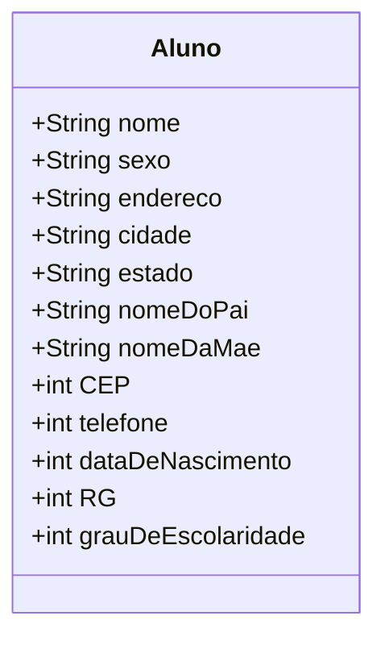
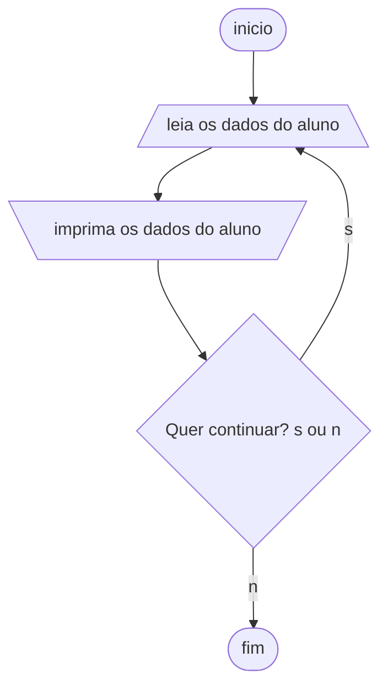
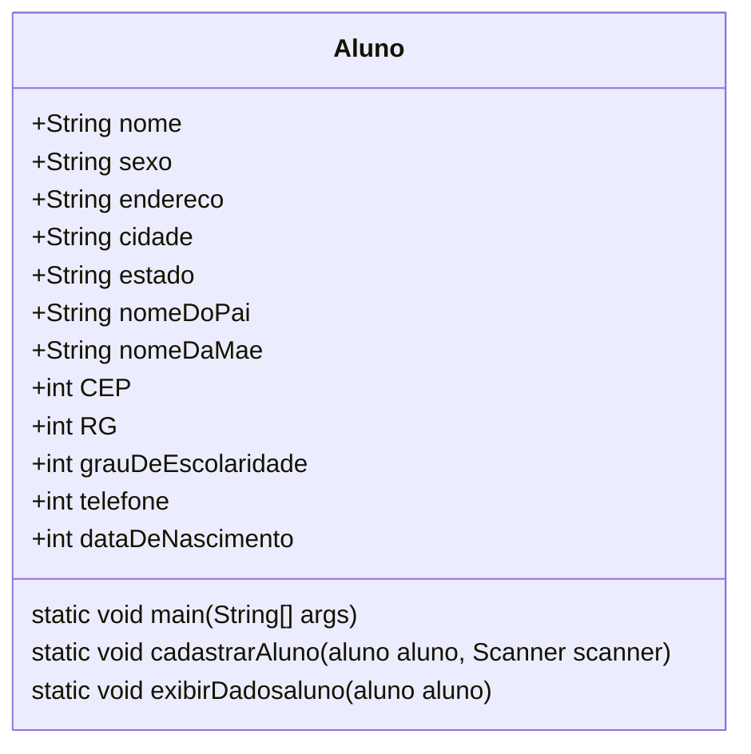

Criar um aplicativo em Java que represente um sistema de cadastro de alunos.

## Fase 1 Cap. 2

Iniciando a proposta, que é construir um sistema de informação, declare as variáveis para o algoritmo de cadastramento de alunos, cujos dados são:

- nome,
- sexo,
- endereço,
- cidade,
- estado,
- CEP,
- telefone,
- data de nascimento,
- RG,
- nome do pai,
- nome da mãe
- grau de escolaridade

Classifique os dados segundo os tipos das variáveis (numéricos, literais ou lógicos) que irão armazená-los.

- Variáveis literais: nome do aluno, sexo, endereço, cidade, estado, nome do pai, nome da mãe.
- Variáveis numéricas: telefone, CEP, RG, data de nascimento, grau de escolaridade.

## Diagrama de classe



Implementação:

```java
public class aluno {
    public String nome, sexo, endereco, cidade,
            estado, nomeDoPai,nomeDaMae ;
    public int cep, rg, grauDeEscolaridade, telefone, dataDeNascimento;    
    
}
```

## Fase2 cap. 4

Atribuição de valores às variáveis:

O usuário entra com valores para preencher as variáveis:

- leia "Entre com o sexo:", SEXO
- leia "Entre com o endereço:", ENDERECO
- leia "Entre com a cidade onde o aluno reside:", CIDADE
- leia "Entre com a sigla do estado onde o aluno reside:", UF
- leia "Entre com o CEP (somente números):", CEP
- leia "Entre com o telefone (somente números):", FONE
- leia "Entre com o nome do pai do aluno:", PAI
- leia "Entre com o nome da mãe do aluno:", MAE
- leia "Entre com o Registro Geral (RG) do aluno (somente números)
- leia "Entre com o grau de escolaridade do aluno (0, 1, 2, 3):", GRAUESC
- escreva "Aluno:", NOME
- escreva "Sexo:", SEXO, "Data de Nascimento:", DATANASC
- escreva "Registro Geral (RG):", RG
- escreva "Grau de escolaridade:", GRAUESC, "grau"
- escreva "Endereço:", ENDERECO, "Cidade:", CIDADE, "Estado:", UF
- escreva "CEP:", CEP
- escreva "Telefone:", FONE
- escreva "Nome do pai:", PAI
- escreva "Nome da mãe:", MAE

Cadastrar 50 alunos significa repetir o algoritmo anterior cinquenta vezes, ou seja, utilizar uma estrutura de repetição; neste caso, utilize a estrutura para/faça/fim-para. Para controlar a quantidade de alunos cadastrados, você deve utilizar uma variável contadora. Antes disso, porém, todas as variáveis do algoritmo devem ser declaradas.

Para criar um aplicativo em Java que cadastre 50 alunos usando uma estrutura de repetição, você pode utilizar o laço `for` para iterar 50 vezes. Aqui está o código atualizado:

```java
import java.util.Scanner;

public class Aluno {
    public String nome, sexo, endereco, cidade, estado, nomeDoPai, nomeDaMae;
    public int cep, rg, grauDeEscolaridade, telefone, dataDeNascimento;

    public static void main(String[] args) {
        Scanner scanner = new Scanner(System.in);

        for (int i = 1; i <= 50; i++) {
            System.out.println("Entre com os dados do aluno " + i + ":");
            Aluno aluno = new Aluno();

            System.out.println("Entre com o nome:");
            aluno.nome = scanner.next();

            System.out.println("Entre com o sexo:");
            aluno.sexo = scanner.next();

            System.out.println("Entre com o endereço:");
            aluno.endereco = scanner.next();

            System.out.println("Entre com a cidade onde o aluno reside:");
            aluno.cidade = scanner.next();

            System.out.println("Entre com a sigla do estado onde o aluno reside:");
            aluno.estado = scanner.next();

            System.out.println("Entre com o CEP (somente números):");
            aluno.cep = scanner.nextInt();

            System.out.println("Entre com o telefone (somente números):");
            aluno.telefone = scanner.nextInt();

            System.out.println("Entre com o nome do pai do aluno:");
            aluno.nomeDoPai = scanner.next();

            System.out.println("Entre com o nome da mãe do aluno:");
            aluno.nomeDaMae = scanner.next();

            System.out.println("Entre com o Registro Geral (RG) do aluno (somente números):");
            aluno.rg = scanner.nextInt();

            System.out.println("Entre com o grau de escolaridade do aluno (0, 1, 2, 3):");
            aluno.grauDeEscolaridade = scanner.nextInt();

            System.out.println("Aluno: " + aluno.nome);
            System.out.println("Sexo: " + aluno.sexo);
            System.out.println("Registro Geral (RG): " + aluno.rg);
            System.out.println("Grau de escolaridade: " + aluno.grauDeEscolaridade);
            System.out.println("Endereço: " + aluno.endereco + ", Cidade: " + aluno.cidade + ", Estado: " + aluno.estado);
            System.out.println("CEP: " + aluno.cep);
            System.out.println("Telefone: " + aluno.telefone);
            System.out.println("Nome do pai: " + aluno.nomeDoPai);
            System.out.println("Nome da mãe: " + aluno.nomeDaMae);
        }
    }
}

```

Nesse código, o laço `for` é usado para repetir o processo de cadastro 50 vezes. A cada iteração, um novo objeto `Aluno` é criado e preenchido com os dados fornecidos pelo usuário. Em seguida, os dados são exibidos na tela.

Lembre-se de que é uma boa prática seguir as convenções de nomenclatura do Java, portanto, o nome da classe `aluno` foi alterado para `Aluno`, começando com letra maiúscula.

Imagine quanto trabalho seu amigo terá para controlar todas as fichas. Para ajudá-lo, você pode desenvolver um programa de computador. Antes, porém, deve criar um algoritmo, seguindo algumas etapas.

## Fase 3 Usando funções

- Refatorar o algoritmo anterior usando funções para separar a lógica em partes mais organizadas e reutilizáveis.
- Colocar uma opção para sair do loop.

### Diagramas

Diagrama de fluxo



Diagrama de classe:



### Implementação

Aqui está o código refatorado:

```java
import java.util.Scanner;

public class Aluno {
    public String nome, sexo, endereco, cidade, estado, nomeDoPai, nomeDaMae;
    public int cep, rg, grauDeEscolaridade, telefone, dataDeNascimento;

    public static void main(String[] args) {
        Aluno aluno = new Aluno();
        Scanner scanner = new Scanner(System.in);

        for (int i = 1; i <= 50; i++) {
            System.out.println("Entre com os dados do aluno " + i + ":");
            cadastrarAluno(aluno, scanner);
            exibirDadosAluno(aluno);
        }
    }

    public static void cadastrarAluno(Aluno aluno, Scanner scanner) {
        System.out.println("Entre com o nome:");
        aluno.nome = scanner.next();

        System.out.println("Entre com o sexo:");
        aluno.sexo = scanner.next();

        System.out.println("Entre com o endereço:");
        aluno.endereco = scanner.next();

        System.out.println("Entre com a cidade onde o aluno reside:");
        aluno.cidade = scanner.next();

        System.out.println("Entre com a sigla do estado onde o aluno reside:");
        aluno.estado = scanner.next();

        System.out.println("Entre com o CEP (somente números):");
        aluno.cep = scanner.nextInt();

        System.out.println("Entre com o telefone (somente números):");
        aluno.telefone = scanner.nextInt();

        System.out.println("Entre com o nome do pai do aluno:");
        aluno.nomeDoPai = scanner.next();

        System.out.println("Entre com o nome da mãe do aluno:");
        aluno.nomeDaMae = scanner.next();

        System.out.println("Entre com o Registro Geral (RG) do aluno (somente números):");
        aluno.rg = scanner.nextInt();

        System.out.println("Entre com o grau de escolaridade do aluno (0, 1, 2, 3):");
        aluno.grauDeEscolaridade = scanner.nextInt();
    }

    public static void exibirDadosAluno(Aluno aluno) {
        System.out.println("Aluno: " + aluno.nome);
        System.out.println("Sexo: " + aluno.sexo);
        System.out.println("Registro Geral (RG): " + aluno.rg);
        System.out.println("Grau de escolaridade: " + aluno.grauDeEscolaridade);
        System.out.println("Endereço: " + aluno.endereco + ", Cidade: " + aluno.cidade + ", Estado: " + aluno.estado);
        System.out.println("CEP: " + aluno.cep);
        System.out.println("Telefone: " + aluno.telefone);
        System.out.println("Nome do pai: " + aluno.nomeDoPai);
        System.out.println("Nome da mãe: " + aluno.nomeDaMae);
    }
}

```

Nesse código refatorado, duas funções foram adicionadas: `cadastrarAluno` e `exibirDadosAluno`.

A função `cadastrarAluno` é responsável por solicitar e armazenar os dados de um aluno fornecidos pelo usuário. Ela recebe um objeto `Aluno` e um scanner como parâmetros. Os dados são preenchidos no objeto `aluno` passado por referência.

A função `exibirDadosAluno` é responsável por exibir os dados de um aluno na tela

Refatorar o código novamente, dessa vez utilizando um construtor na classe `Aluno` para inicializar os objetos e o método `toString()` para exibir os dados de cada aluno. Aqui está o código refatorado:

```java
import java.util.Scanner;

public class Aluno {
    public String nome, sexo, endereco, cidade, estado, nomeDoPai, nomeDaMae;
    public int cep, rg, grauDeEscolaridade, telefone, dataDeNascimento;

    public Aluno(String nome, String sexo, String endereco, String cidade, String estado, String nomeDoPai, String nomeDaMae,
                 int cep, int rg, int grauDeEscolaridade, int telefone, int dataDeNascimento) {
        this.nome = nome;
        this.sexo = sexo;
        this.endereco = endereco;
        this.cidade = cidade;
        this.estado = estado;
        this.nomeDoPai = nomeDoPai;
        this.nomeDaMae = nomeDaMae;
        this.cep = cep;
        this.rg = rg;
        this.grauDeEscolaridade = grauDeEscolaridade;
        this.telefone = telefone;
        this.dataDeNascimento = dataDeNascimento;
    }

    @Override
    public String toString() {
        return "Aluno: " + nome + "\\n" +
                "Sexo: " + sexo + "\\n" +
                "Registro Geral (RG): " + rg + "\\n" +
                "Grau de escolaridade: " + grauDeEscolaridade + "\\n" +
                "Endereço: " + endereco + ", Cidade: " + cidade + ", Estado: " + estado + "\\n" +
                "CEP: " + cep + "\\n" +
                "Telefone: " + telefone + "\\n" +
                "Nome do pai: " + nomeDoPai + "\\n" +
                "Nome da mãe: " + nomeDaMae;
    }

    public static void main(String[] args) {
        Scanner scanner = new Scanner(System.in);

        for (int i = 1; i <= 50; i++) {
            System.out.println("Entre com os dados do aluno " + i + ":");
            Aluno aluno = cadastrarAluno(scanner);
            System.out.println(aluno);
        }
    }

    public static Aluno cadastrarAluno(Scanner scanner) {
        System.out.println("Entre com o nome:");
        String nome = scanner.next();

        System.out.println("Entre com o sexo:");
        String sexo = scanner.next();

        System.out.println("Entre com o endereço:");
        String endereco = scanner.next();

        System.out.println("Entre com a cidade onde o aluno reside:");
        String cidade = scanner.next();

        System.out.println("Entre com a sigla do estado onde o aluno reside:");
        String estado = scanner.next();

        System.out.println("Entre com o CEP (somente números):");
        int cep = scanner.nextInt();

        System.out.println("Entre com o telefone (somente números):");
        int telefone = scanner.nextInt();

        System.out.println("Entre com o nome do pai do aluno:");
        String nomeDoPai = scanner.next();

        System.out.println("Entre com o nome da mãe do aluno:");
        String nomeDaMae = scanner.next();

        System.out.println("Entre com o Registro Geral (RG) do aluno (somente números):");
        int rg = scanner.nextInt();

        System.out.println("Entre com o grau de escolaridade do aluno (0,

 1, 2, 3):");
        int grauDeEscolaridade = scanner.nextInt();

        return new Aluno(nome, sexo, endereco, cidade, estado, nomeDoPai, nomeDaMae, cep, rg, grauDeEscolaridade, telefone, 0);
    }
}

```

Nesse código refatorado, a classe `Aluno` possui um construtor que recebe todos os dados do aluno como parâmetros. Esse construtor inicializa os atributos da classe com os valores fornecidos.

Também foi adicionado o método `toString()` na classe `Aluno`, que retorna uma string formatada contendo os dados do aluno.

No método `cadastrarAluno()`, os dados do aluno são solicitados ao usuário e retornados como um novo objeto `Aluno` criado usando o construtor.

No método `main()`, o laço `for` é utilizado para cadastrar e exibir os dados dos 50 alunos.

Agora, ao chamar `System.out.println(aluno)`, a representação em formato de string dos dados do aluno será exibida automaticamente.

## Referências

- [GitHub: Cadastro de alunos](https://github.com/jocile/cadastro-de-alunos/)
- Xavier, Gley Fabiano Cardoso Lógica de programação E-book, capítulos 2, 4 e 8. Disponível em: <https://bibliotecadigitalsenac.com.br/?from=%3FcontentInfo%3D1306#/legacy/epub/1306> Acesso em 15/05/2023
- [Editor de diagramas Mermaid](https://mermaid.live/)
