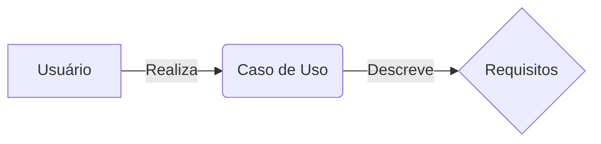
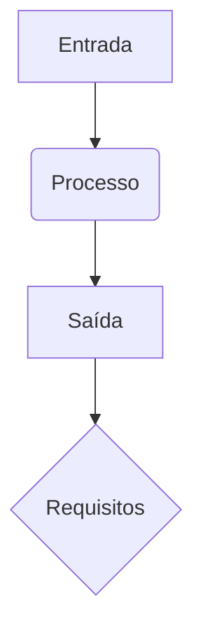
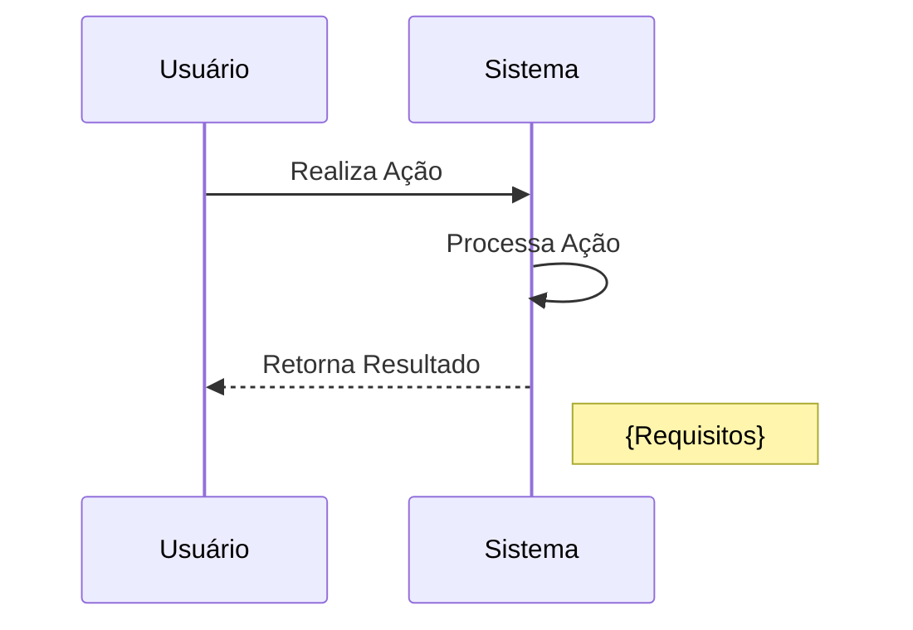
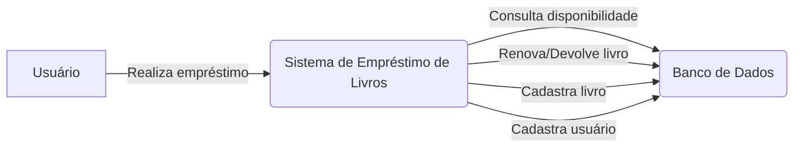
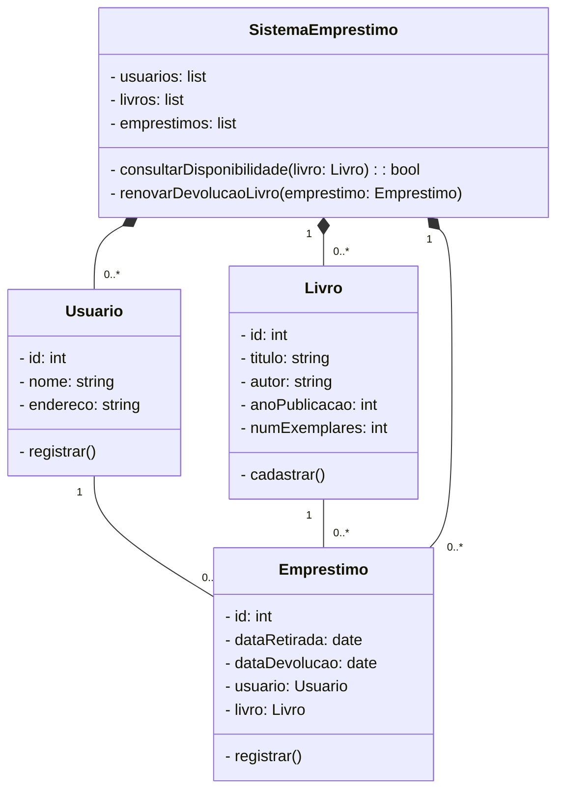
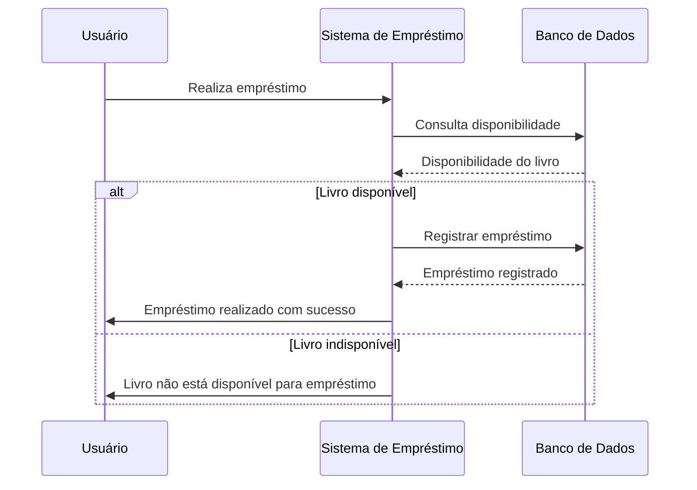

O gerenciamento de requisitos é uma parte fundamental do desenvolvimento de software, pois garante que as necessidades dos clientes e usuários sejam adequadamente capturadas e traduzidas em funcionalidades do sistema.

## Levantamento de Requisitos

O levantamento de requisitos é a fase inicial e uma das etapas mais importantes do desenvolvimento de um sistema. É nessa etapa que buscamos compreender o que o cliente realmente precisa para o software, levando em consideração as regras dos processos de negócio. Antes de iniciar um projeto de software, é essencial saber quais requisitos o software deve atender. O objetivo principal do levantamento de requisitos é garantir que os usuários e os desenvolvedores tenham a mesma visão do problema a ser resolvido.

### O que é um requisito?

Um requisito é uma condição ou capacidade que um sistema ou componente deve alcançar ou possuir para satisfazer um contrato, padrão ou especificação formalmente estabelecida. Em outras palavras, é algo que o software deve oferecer ou uma função que o software deve executar. Identificar requisitos envolve obter informações sobre o que o sistema deve ter, geralmente trabalhando em conjunto com os stakeholders e especialistas da área de negócio.

### Importância do levantamento de requisitos

O levantamento de requisitos é fundamental para evitar problemas durante o desenvolvimento do software. Alguns problemas clássicos que podem ser causados por uma análise malfeita ou incompleta incluem:

1. **Comunicação inadequada:** Uma comunicação deficiente entre o cliente e o analista pode levar a informações insuficientes ou mal interpretadas, resultando em requisitos incorretos.
2. **Mudanças nos requisitos:** Os requisitos podem mudar ao longo do tempo, e é necessário gerenciar essas alterações adequadamente para garantir que o software seja desenvolvido de acordo com as necessidades atuais.
3. **Falta de conhecimento do domínio:** É importante compreender o domínio de negócio no qual o software será aplicado. Caso os desenvolvedores não tenham conhecimento suficiente sobre o domínio, pode ser difícil desenvolver um software adequado e alinhado às necessidades dos usuários.

Ao realizar um levantamento de requisitos eficiente, podemos obter um documento que lista os requisitos que o sistema deverá atender. Esse documento pode ser escrito em linguagem informal ou em forma de casos de uso, tornando mais fácil para pessoas não técnicas compreenderem os requisitos.

## Tipos de requisitos

Existem diferentes tipos de requisitos no processo de análise e desenvolvimento de software. Vou citar alguns exemplos dos principais tipos de requisitos:

1. **Requisitos Funcionais:** São os requisitos que descrevem as funções e as operações específicas que o sistema deve realizar. Eles descrevem o comportamento esperado do software e como ele deve responder a diferentes entradas. Exemplo: "O sistema deve permitir que os usuários façam login usando nome de usuário e senha."
2. **Requisitos Não Funcionais:** São os requisitos que descrevem as características e propriedades do sistema, além das suas funcionalidades. Eles não estão relacionados diretamente às funções do software, mas afetam a sua qualidade e desempenho. Exemplo: "O sistema deve ser capaz de suportar até 1000 usuários simultaneamente."
3. **Requisitos de Usuário:** São os requisitos que representam as necessidades, expectativas e restrições dos usuários finais do sistema. Eles descrevem como o sistema deve ser do ponto de vista dos usuários. Exemplo: "O sistema deve ter uma interface intuitiva e fácil de usar."
4. **Requisitos de Sistema:** São os requisitos que descrevem as características e comportamentos do sistema como um todo, incluindo componentes de hardware, software e rede. Exemplo: "O sistema deve ser compatível com o sistema operacional Windows 10."
5. **Requisitos de Domínio:** São os requisitos que se referem a regras, políticas e restrições específicas do domínio de negócio em que o sistema será aplicado. Eles refletem as particularidades e necessidades únicas do setor ou da organização. Exemplo: "O sistema deve seguir as regulamentações de segurança da indústria bancária."
6. **Requisitos de Desempenho:** São os requisitos que definem as metas de desempenho do sistema, como tempo de resposta, capacidade de processamento e uso eficiente de recursos. Exemplo: "O sistema deve fornecer resultados de pesquisa em menos de 1 segundo."
7. **Requisitos de Segurança:** São os requisitos que descrevem as medidas de segurança que o sistema deve implementar para proteger os dados e garantir a privacidade dos usuários. Exemplo: "O sistema deve criptografar os dados confidenciais do usuário durante a transmissão."

> Esses são apenas alguns exemplos dos tipos de requisitos de análise de desenvolvimento de software. É importante identificar e documentar corretamente os requisitos para garantir que o sistema atenda às necessidades dos usuários e às expectativas dos stakeholders.
{: .prompt-info }

## Diagramas UML de requisitos

Aqui estão alguns exemplos de diagramas que podem ser usados para representar requisitos usando a linguagem Mermaid:

1. **Diagrama de Caso de Uso:**

Neste diagrama, o caso de uso representa uma interação entre um usuário e o sistema, descrevendo a funcionalidade que o sistema deve fornecer. Os requisitos estão associados ao caso de uso, indicando quais requisitos estão relacionados a ele.

1. **Diagrama de Fluxo de Dados:**

Neste diagrama, as setas representam o fluxo de dados no sistema, mostrando a entrada, o processamento e a saída dos dados. Os requisitos estão associados ao processo, indicando quais requisitos estão envolvidos no fluxo de dados.

1. **Diagrama de Sequência:**

Neste diagrama, a interação entre o usuário e o sistema é representada em uma sequência de mensagens. Os requisitos são indicados por uma nota associada ao sistema, descrevendo quais requisitos estão envolvidos nessa sequência.

> Esses são apenas alguns exemplos de diagramas que podem ser usados para representar requisitos usando a linguagem Mermaid. A escolha do diagrama depende do contexto e da necessidade específica de representação dos requisitos do sistema. Lembre-se de adaptar os exemplos de acordo com as suas necessidades e especificações do seu projeto.
{: .prompt-tip }

adaptar os exemplos de acordo com as suas necessidades e especificações do seu projeto.

## Exemplo com sistema de biblioteca

Aqui está um exemplo básico de como um projeto de gerenciamento de requisitos para um sistema de empréstimo de livros de uma biblioteca pode ser estruturado:

1. **Descrição do Sistema:**
    - Nome do sistema: Sistema de Empréstimo de Livros da Biblioteca
    - Objetivo: Permitir que os usuários da biblioteca realizem empréstimos de livros de forma eficiente e organizada.
2. **Partes Interessadas:**
    - Bibliotecários: Responsáveis por administrar o sistema e gerenciar os empréstimos de livros.
    - Usuários da Biblioteca: Pessoas que desejam emprestar livros da biblioteca.
3. **Escopo:**
    - Funcionalidades Iniciais:
        - Registro de usuários da biblioteca.
        - Registro de livros no acervo da biblioteca.
        - Registro de empréstimos de livros.
        - Consulta de disponibilidade de livros.
        - Renovação e devolução de livros emprestados.
4. **Requisitos Funcionais:**
    - RF1: Os usuários devem ser capazes de se registrar no sistema fornecendo informações pessoais, como nome, endereço e número de identificação.
    - RF2: Os bibliotecários devem poder cadastrar livros no sistema, incluindo informações como título, autor, ano de publicação e número de exemplares disponíveis.
    - RF3: Os usuários devem poder solicitar empréstimos de livros disponíveis no sistema, fornecendo o número de identificação do usuário e o código do livro.
    - RF4: O sistema deve permitir que os bibliotecários gerenciem os empréstimos, registrando as informações do empréstimo, como data de retirada e data de devolução esperada.
    - RF5: Os usuários devem poder consultar a disponibilidade de um livro específico no sistema.
    - RF6: O sistema deve permitir que os usuários renovem ou devolvam os livros emprestados.
5. **Requisitos Não Funcionais:**
    - RNF1: O sistema deve ter uma interface intuitiva e fácil de usar para os usuários.
    - RNF2: O sistema deve ser capaz de lidar com um grande número de usuários simultâneos sem comprometer o desempenho.
    - RNF3: O sistema deve ser seguro, protegendo as informações pessoais dos usuários.
    - RNF4: O sistema deve ser confiável, garantindo que as transações sejam registradas corretamente e que nenhum livro seja emprestado indevidamente.
6. **Rastreabilidade de Requisitos:**
    - Mapear cada requisito funcional e não funcional para os casos de uso relevantes, diagramas ou documentação associada.
7. **Controle de Mudanças:**
    - Estabelecer um processo para solicitar, avaliar e aprovar mudanças nos requisitos do sistema, garantindo que todas as alterações sejam adequadamente documentadas e comunicadas.

> Lembre-se de que este é apenas um exemplo básico de como um projeto de gerenciamento de requisitos para um sistema de empréstimo de livros de uma biblioteca pode ser estruturado. Na prática, o projeto de gerenciamento de requisitos pode ser mais detalhado, incluindo
{: .prompt-info }

## Exemplo com diagramas UML

Aqui estão alguns exemplos de diagramas UML (Unified Modeling Language) no formato Mermaid que podem ser utilizados no projeto de gerenciamento de requisitos de um sistema de empréstimo de livros de uma biblioteca:

1. **Diagrama de Casos de Uso:**

2. **Diagrama de Classes:**

3. **Diagrama de Sequência (Realização de Empréstimo):**

> Esses são apenas exemplos básicos de diagramas UML que podem ser usados no projeto de gerenciamento de requisitos para um sistema de empréstimo de livros de uma biblioteca. Você pode adaptar e expandir esses diagramas de acordo com os requisitos e funcionalidades específicas do sistema.
{: .prompt-tip }

## Referências

[{: w="200" h="50" }](http://www.youtube.com/watch?v=22gtIfAdelU)
[{: w="200" h="50" }](http://www.youtube.com/watch?v=VcOeM2AD8Yk)

- [Requisitos Funcionais, Não Funcionais e De Domínio](https://andremaretti.wordpress.com/2014/03/09/requisitos-funcionais-nao-funcionais-e-de-dominio/)
- [Editor de diagramas Mermaid](https://mermaid.live/)
- [Livro restrito da biblioteca Senac - {{site.data.references.apostilas.senac[8].name}} - capítulos 5 e 7]({{site.data.references.apostilas.senac[8].link}})
