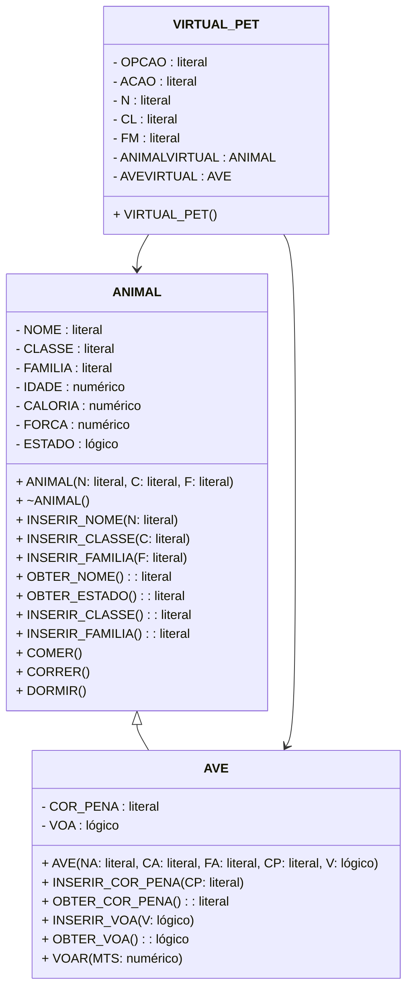
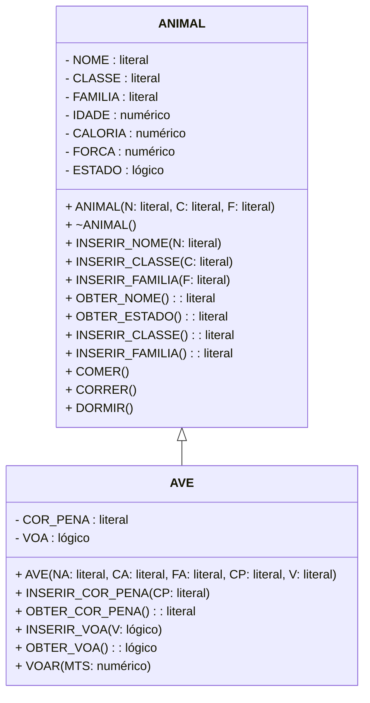

Uma das principais características e vantagens da OO é a possibilidade de reutilização de código. Uma das propriedades que as classes podem ter que permite este reúso é a herança.

Assim como no mundo real, as gerações posteriores agregam características e conhecimento das gerações anteriores, a OO prevê que uma classe possa "passar" suas características e comportamentos para outras classes por meio do recurso da herança.
Baseado no exemplo do jogo Virtual PET para criar a simulação de um bicho de estimação virtual, imagine que fosse necessário implementar algumas características especiais para um grupo específico de animais doméstico como aves.

Essa implementação seria a inserção dos atributos COR_PENA (literal) e VOA(lógico) e o método VOAR (método que receberá um número entre 0 e 100 para especificar a distância em metros que será percorrida pela ave, bem como retirará 0,5 caloria, para cada metro, se ela puder voar além de 3 metros do atributo força).

Você poderá até se perguntar: não há outros bichos que voam? Sim, porém para ilustrar este exemplo, serão mencionados apenas animais que voam e são domésticos (apesar de algumas pessoas criarem morcegos, abelhas, etc.).
A partir daí, a primeira menção será inserir imediatamente na classe ANIMAL os atributos e o método solicitados.
Nesse caso, todos os animais passariam a ter essas características e esse método. Isso seria extremamente errado, pois um gato não possui COR_PENA e não pode VOAR.
A outra possibilidade seria criar outra classe chamada AVE e "copiar" todos os atributos e métodos para ela, acrescentando os já solicitados.
Nesse caso, apesar de parecer mais correto, haveria dois inconvenientes.

Primeiro, a necessidade de codificar novamente uma outra classe com toda codificação.
E o segundo, não haveria nenhuma ligação entre as classes. Isso faria com que qualquer alteração importante na classe Animal não fosse refletida na classe Ave.

A herança entre classes resolveria esse problema, pois a Ave não deixou de pertencer à classe. Ela apenas terá a necessidade de especificar mais algumas características e ações.

O sistema Virtual PET poderá ser confeccionado em uma ou mais classe, ou seja, se você tiver na classe Animal o método principal que gera a aplicação, dirá que essa classe é uma classe de definição e aplicação (possui as definições - atributos e métodos - e a aplicação - o método principal que tem a responsabilidade de executar o sistema).
Porém, você poderá ter duas classes: Animal e Virtual PET, sendo a primeira uma classe de definição e a segunda de aplicação.

## Primeira possibilidade

Primeira possibilidade: três classes, duas de definição (ANIMAL e AVE) e uma de aplicação (VIRTUAL PET). Veja o exemplo a seguir:

### 1P Diagrama de classes UML

Aqui está o diagrama de classe UML representando as classes "ANIMAL", "AVE" e "VIRTUAL_PET" com base no código fornecido:



Observe que a classe `VIRTUAL_PET` é representada separadamente, mesmo que seja apenas uma coleção de variáveis e métodos relacionados. Os relacionamentos de herança e composição são mostrados corretamente no diagrama.

### 1P Algoritmo

```plaintext
classe ANIMAL
  
  protegido NOME, CLASSE, FAMILIA : literal
  protegido IDADE,CALORIA,FORCA: numérico
  protegido ESTADO:lógico
  construtor ANIMAL (N, C, F: literal)  
    NOME ← N
    CLASSE ← C
    FAMILIA ← F
    CALORIA ← 10
    FORCA ← 10
    ESTADO ← verdadeiro
    IDADE ← 0   
  fim-construtor

  destruidor ANIMAL (  )  
    ESTADO ← falso
    FORCA ← 0 
      escreva "Morto!"  
  fim-destruidor

  método público INSERIR_NOME (N: literal)  
      NOME ← N  
  fim-método

  método público INSERIR_CLASSE (C: literal)  
      CLASSE ← C  
  fim-método

  método público INSERIR_FAMILIA (F: literal)  
    FAMILIA ← F  
  fim-método

  método público literal OBTER_NOME (  )
    retorne NOME   
  fim-método

  método público literal OBTER_ESTADO (  )  
    retorne ESTADO   
  fim-método

  método público literal INSERIR_CLASSE (  )  
    retorne CLASSE   
  fim-método

  método público literal INSERIR_FAMILIA (  )  
    retorne FAMILIA   
  fim-método

  método público COMER (  )  
    se (ESTADO e FORCA > 10)   
      então CALORIA ← CALORIA + 20
        FORCA ← FORCA - 10
    senão se (ESTADO)
      então escreva "O animal está morto e não pode comer!"
      senão escreva "O animal está exausto!Faça-o dormir um pouco!"  
      fim-se  
    fim-se  
  fim-método

  método público CORRER ( )  
    se (ESTADO e FORCA > 10 e CALORIA > 10 )   
      então CALORIA ← CALORIA - 10
        FORCA ← FORCA - 10
    senão se (ESTADO)  
      então escreva "O animal está morto e não pode correr!"
    senão se (CALORIA < 10)  
      então escreva "O animal está fraco!Faça-o comer!"
    senão escreva "O animal está exausto! Faça-o dormir!"  
      fim-se  
  fim-método

  método público DORMIR ( )  
    se (ESTADO)   
      então CALORIA ← CALORIA - 5
        FORCA ← FORCA +20
    senão escreva "O animal está morto!"  
    fim-se  
  fim-método.
fim-classe

classe AVE herda_de ANIMAL

privado COR_PENA: literal
privado VOA:lógico

construtor AVE (NA,CA,FA,CP,V:literal)
  super.ANIMAL (NA, CA, FA)
  COR_PENA ← CP
  VOA ← V
fim-construtor

método público INSERIR_COR_PENA(CP:literal)
  COR_PENA ← CP
fim-método

método público literal OBTER_COR_PENA(  )
  retorne COR_PENA 
fim-método

método público INSERIR_VOA(V:lógico)
    VOA ← V
fim-método

método público lógico OBTER_VOA(  )
    retorne VOA 
fim-método

método público VOAR ( MTS:numérico )
  se (super.ESTADO e VOA e FORCA > = 3 e CALORIA > MTS*0,5)
    então CALORIA ← CALORIA -  MTS*0,5
      FORCA ← FORCA - 3
  senão se (super.ESTADO)
    então escreva "A ave está morta e não pode voar!"
  senão se (não VOA)
    então escreva "A ave não voa!"
  senão escreva "A ave está exausta! Faça-a dormir um pouco!"
  fim-se
fim-classe

classe VIRTUAL_PET

início

OPCAO,ACAO,N,CL,FM :literal
ANIMAL ANIMALVIRTUAL 
AVE  AVEVIRTUAL 
escreva "Você quer cuidar de uma ave ou outro animal? Digite 1 → Ave, 2 → Outro animal  ou 0 → Encerrar"

leia OPCAO
enquanto (OPCAO <> 0) faça

se (OPCAO = 1)
  então escreva "Qual o nome da sua ave?"
  leia N
  escreva "Qual a classe da sua ave?"
  leia CL
  escreva "Qual a família da ave?"
  leia FM
  escreva "Qual  a cor da pena da ave?"
  leia CP 
  escreva "A sua ave voa?"
  leia V
  AVEVIRTUAL ← novo AVE (N,CL,FM,CP,V)
  escreva "Sua ave ",AVEVIRTUAL.OBTER_NOME( ), "nasceu!"
  senão escreva "Qual o nome do seu animal?"
  leia N
  escreva "Qual a classe do seu animal?"
  leia CL
  escreva "Qual a família do seu animal?"
  leia FM
  ANIMAL VIRTUAL ← ANIMAL(N,CL,FM)
  escreva "Seu animal ",ANIMAL.OBTER_NOME( ), "nasceu!"
fim-se
repita
  se (OPCAO = 1)
    então se (ANIMAL VIRTUAL.OBTER_ESTADO( ) )
    então escreva "Digite a ação você quer ?"
    escreva "C → Comer, R → correr ou D → Dormir ou E → Encerrar"
    leia ACAO
  senão ACAO ← "MORTO"
  fim-se
caso ACAO
  seja "C" faça ANIMAL VIRTUAL.COMER( )
  seja "R" faça ANIMAL VIRTUAL.CORRER( )
  seja "D" faça ANIMAL VIRTUAL.DORMIR( )
  seja "E" faça escreva "Você está abandonando seu animal!"
  seja "MORTO" faça escreva "Seu animal morreu! Não há mais chance!"
  senão escreva "Ação inválida!"
fim-caso
senão se (AVEVIRTUAL.OBTER_ESTADO( ) )
  então escreva "Digite a ação você quer ?"
  escreva "C ← Comer, R ← correr, V← Voar,  D ← Dormir ou E ← Encerrar"
  leia ACAO
senão ACAO ← "E"
fim-se
caso ACAO
  seja "C" faça AVEVIRTUAL.COMER( )
  seja "R" faça AVEVIRTUAL.CORRER( )
  seja "V" faça AVEVIRTUAL.VOAR ( )
  seja "D" faça AVEVIRTUAL.DORMIR ( )
  seja "E" faça escreva "Você está abandonando seu animal!"
  seja "MORTO" faça escreva "Seu animal morreu! Não há mais chance!"
  senão escreva "Ação inválida!"
fim-caso
fim-se

até que (ACAO = "E")
  escreva "Você quer cuidar de uma ave ou outro animal? Digite 1 → Ave, 2→ Outro animal  ou 0→ Encerrar"
  leia OPCAO
fim-enquanto

fim
fim-classe

```

## Segunda possibilidade

Segunda possibilidade: duas classes, uma somente de definição (ANIMAL) e outra contendo definição e aplicação (AVE). Como mostra o exemplo a seguir:

### 2P diagrama de classes

Aqui está o diagrama de classes UML em formato Mermaid para as classes "ANIMAL" e "AVE":



Este é o diagrama de classes UML que representa a estrutura das classes "ANIMAL" e "AVE". A classe "ANIMAL" contém os atributos NOME, CLASSE, FAMILIA, IDADE, CALORIA, FORCA e ESTADO, juntamente com os métodos construtor, destruidor e outros métodos como INSERIR_NOME, INSERIR_CLASSE, OBTER_NOME, COMER, CORRER e DORMIR.

A classe "AVE" herda da classe "ANIMAL" e adiciona os atributos COR_PENA e VOA, juntamente com os métodos construtor, INSERIR_COR_PENA, OBTER_COR_PENA, INSERIR_VOA, OBTER_VOA e VOAR.

A seta "ANIMAL <|-- AVE" indica que a classe "AVE" herda da classe "ANIMAL".

### 2P algoritmo

```plaintext
classe ANIMAL

protegido NOME, CLASSE, FAMILIA : literal
protegido IDADE,CALORIA,FORCA: numérico
protegido ESTADO:lógico
construtor ANIMAL (N, C, F: literal)

  NOME ← N
  CLASSE ← C
  FAMILIA ← F
  CALORIA ← 10
  FORCA ← 10
  ESTADO ← verdadeiro
  IDADE ← 0 

fim-construtor
destruidor ANIMAL (  )

  ESTADO ← falso
  FORCA ← 0 
  escreva "Morto!"

fim-destruidor
método público INSERIR_NOME (N: literal)
  NOME ← N
fim-método

método público INSERIR_CLASSE (C: literal)
  CLASSE ← C
fim-método

método público INSERIR_FAMILIA (F: literal)
  FAMILIA ← F
fim-método

método público literal OBTER_NOME (  )
  retorne NOME 
fim-método

método público literal OBTER_ESTADO (  )
  retorne ESTADO 
fim-método

método público literal INSERIR_CLASSE (  )
  retorne CLASSE 
fim-método

método público literal INSERIR_FAMILIA (  )
  retorne FAMILIA 
fim-método

método público COMER (  )
  se (ESTADO e FORCA > 10) 
    então CALORIA ← CALORIA + 20
      FORCA ← FORCA - 10
  senão se (ESTADO)
    então escreva "O animal está morto e não pode comer!"
    senão escreva "O animal está exausto!Faça-o dormir um pouco!"
  fim-se
  fim-se
fim-método

método público CORRER ( )
  se (ESTADO e FORCA > 10 e CALORIA > 10 ) 
    então CALORIA ← CALORIA - 10
      FORCA ← FORCA - 10
  senão se (ESTADO)
    então escreva "O animal está morto e não pode correr!"
  senão se (CALORIA < 10)
    então escreva "O animal está fraco! Faça-o comer!"
  senão escreva "O animal está exausto! Faça-o dormir!"
  fim-se
  fim-se
fim-método

método público DORMIR ( )
  se (ESTADO) 
    então CALORIA ← CALORIA - 5
    FORCA ← FORCA +20
  senão escreva "O animal está morto!"  
  fim-se  
fim-método

fim-classe

classe AVE herda_de ANIMAL
  
privado COR_PENA: literal
privado VOA:lógico

construtor AVE (NA,CA,FA,CP,V:literal)  
  super.ANIMAL (NA, CA, FA)
  COR_PENA ← CP
  VOA ← V  
fim-construtor

método público INSERIR_COR_PENA(CP:literal)
  COR_PENA ← CP  
fim-método

método público literal OBTER_COR_PENA(  )  
  retorne COR_PENA   
fim-método

método público INSERIR_VOA(V:lógico)  
  VOA ← V  
fim-método

método público lógico OBTER_VOA(  )  
  retorne VOA   
fim-método

método público VOAR ( MTS:numérico )  
  se (super.ESTADO e VOA e FORCA > = 3 e CALORIA > MTS*0,5)  
    então CALORIA ← CALORIA -  MTS*0,5
      FORCA ← FORCA - 3
  senão se (super.ESTADO)
    então escreva "A ave está morta e não pode voar!"
  senão se (não VOA)  
    então escreva "A ave não voa!"
  senão escreva "A ave está exausta! Faça-a dormir um pouco!"  
  fim-se  
  fim-se
fim-método

início

OPCAO,ACAO,N,CL,FM :literal
ANIMAL ANIMAL VIRTUAL 
AVE  AVEVIRTUAL 

escreva "Você quer cuidar de uma ave ou outro animal? Digite 1 → Ave, 2 → Outro animal  ou 0 → Encerrar"
leia OPCAO

enquanto (OPCAO <> 0) faça
  se (OPCAO = 1)
    então escreva "Qual o nome da sua ave?"
    leia N
    escreva "Qual a classe da sua ave?"
    leia CL
    escreva "Qual a família da ave?"
    leia FM
    escreva "Qual  a cor da pena da ave?"
    leia CP 
    escreva "A sua ave voa?"
    leia V
    AVEVIRTUAL ← novo AVE (N,CL,FM,CP,V)
    escreva "Sua ave ",AVEVIRTUAL.OBTER_NOME( ), "nasceu!"
  senão escreva "Qual o nome do seu animal?"
    leia N
    escreva "Qual a classe do seu animal?"
    leia CL
    escreva "Qual a família do seu animal?"
    leia FM
    ANIMALVIRTUAL ← ANIMAL(N,CL,FM)
    escreva "Seu animal ",ANIMAL.OBTER_NOME( ), "nasceu!"
  fim-se
repita
  se (OPCAO = 1)
    então se (ANIMALVIRTUAL.OBTER_ESTADO( ) )
    então escreva "Digite a ação você quer ?"
    escreva "C → Comer, R → correr ou D → Dormir ou E → Encerrar"
    leia ACAO
  senão ACAO ← "MORTO"
fim-se

caso ACAO
  seja "C" faça ANIMALVIRTUAL.COMER( )
  seja "R" faça ANIMALVIRTUAL.CORRER( )
  seja "D" faça ANIMALVIRTUAL.DORMIR ( )
  seja "E" faça escreva "Você está abandonando seu animal!"
  seja "MORTO" faça escreva "Seu animal morreu! Não há mais chance!"
  senão escreva "Ação inválida!"
fim-caso
senão se (AVEVIRTUAL.OBTER_ESTADO( ) )
  então escreva "Digite a ação você quer ?"
  escreva "C → Comer, R → correr, V → Voar,  D → Dormir ou E → Encerrar"
  leia ACAO
senão ACAO ← "E"
fim-se

caso ACAO
  seja "C" faça AVEVIRTUAL.COMER( )
  seja "R" faça AVEVIRTUAL.CORRER( )
  seja "V" faça AVEVIRTUAL.VOAR ( )
  seja "D" faça AVEVIRTUAL.DORMIR ( )
  seja "E" faça escreva "Você está abandonando seu animal!"
  seja "MORTO" faça escreva "Seu animal morreu! Não há mais chance!"
  senão escreva "Ação inválida!"
fim-caso
fim-se

até que (ACAO = "E")
  escreva "Você quer cuidar de uma ave ou outro animal? Digite 1 → Ave, 2 → Outro animal  ou 0 → Encerrar"
  leia OPCAO
fim-enquanto

fim
fim-classe

```

## Implementação

A implementação da primeira possibilidade, usando 3 classes está no repositório do Github: [github.com/jocile/virtualpet](https://github.com/jocile/virtualpet/tree/master/src/main/java)

## Referências

[GitHub VirtualPet](https://github.com/jocile/virtualpet)

Xavier, Gley Fabiano Cardoso - Lógica de programação cap. 10, E-book. Disponível em: [https://bibliotecadigitalsenac.com.br/?from=%3FcontentInfo%3D1306#/legacy/epub/1306](https://bibliotecadigitalsenac.com.br/?from=%3FcontentInfo%3D1306#/legacy/epub/1306). Acesso em 19/05/2023
