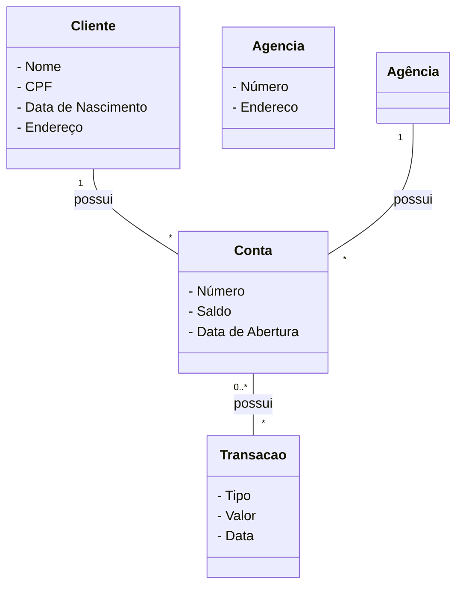
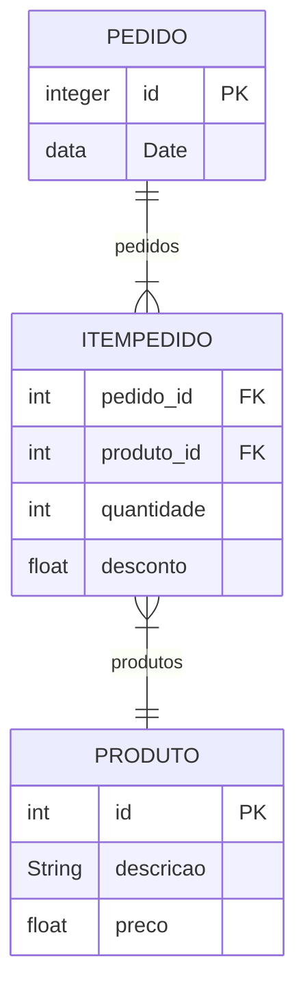

A modelagem de domínio é uma técnica utilizada na engenharia de software para compreender, representar e organizar as entidades, relacionamentos e comportamentos de um determinado domínio de negócio. Essa técnica é essencial para o desenvolvimento de sistemas de software, pois permite a criação de um modelo abstrato que reflete a realidade do domínio em questão.

Neste artigo, vamos explorar os conceitos básicos da modelagem de domínio e apresentar um exemplo prático passo a passo para ilustrar como aplicá-la de forma eficiente.

## 1. Entidades

As entidades são os elementos fundamentais da modelagem de domínio, representando os objetos ou conceitos relevantes para o domínio em questão. Elas podem ser tangíveis, como um cliente ou um produto, ou abstratas, como um pedido ou uma transação. Para identificar as entidades, é necessário compreender os requisitos e características do domínio em análise.

Exemplo:
Suponhamos que estamos desenvolvendo um sistema de gerenciamento de uma loja online. Algumas das entidades relevantes para esse domínio seriam: Cliente, Produto, Pedido e Carrinho de Compras.

## 2. Atributos

Os atributos representam as características ou propriedades das entidades. Eles descrevem informações específicas associadas a uma entidade e fornecem detalhes adicionais para a modelagem do domínio. Os atributos podem ser simples, como um nome ou um número de telefone, ou compostos, como um endereço, que possui subatributos, como rua, cidade e país.

Exemplo:
No contexto do sistema de gerenciamento de uma loja online, algumas possíveis atributos para a entidade Cliente seriam: Nome, E-mail, Telefone e Endereço.

## 3. Relacionamentos

Os relacionamentos representam as associações entre as entidades. Eles descrevem como as entidades estão conectadas e interagem umas com as outras. Existem diferentes tipos de relacionamentos, como um para um, um para muitos e muitos para muitos, que dependem das regras do domínio em análise.

Exemplo:
Considerando o sistema de gerenciamento de uma loja online, podemos ter os seguintes relacionamentos: um Cliente pode ter um ou muitos Pedidos, um Pedido pode conter um ou muitos Produtos e um Carrinho de Compras pode conter um ou muitos Produtos.

## 4. Agregação e Composição

Agregação e composição são tipos especiais de relacionamentos que indicam a natureza da dependência entre as entidades. A agregação representa uma relação de "todo-parte", em que uma entidade pode ser composta por várias outras entidades, mas essas entidades podem existir independentemente. Já a composição indica uma relação de "todo-parte" em que as partes só existem dentro do todo e são completamente dependentes dele.

Exemplo:
No contexto do sistema de gerenciamento de uma loja online, podemos considerar que um Pedido é composto por vários itens de Produto. Essa relação seria um exemplo de composição, já que os itens do Pedido dependem completamente do Pedido em si.

## Exemplo Prático: Modelagem de Domínio para um Sistema Bancário

Vamos agora exemplificar a modelagem de domínio passo

a passo para um sistema bancário simples.

Passo 1: Identificar as entidades:
As entidades relevantes para um sistema bancário poderiam ser: Cliente, Conta, Transação e Agência.

Passo 2: Definir os atributos:
Para a entidade Cliente, poderíamos ter os atributos: Nome, CPF, Data de Nascimento e Endereço.
Para a entidade Conta, poderíamos ter os atributos: Número, Saldo e Data de Abertura.
Para a entidade Transação, poderíamos ter os atributos: Tipo, Valor e Data.
Para a entidade Agência, poderíamos ter os atributos: Número e Endereço.

Passo 3: Estabelecer os relacionamentos:
Um Cliente pode ter uma ou várias Contas.
Uma Conta pode ter várias Transações.
Uma Agência pode ter várias Contas.

Passo 4: Identificar agregações ou composições:
Neste exemplo, não temos agregações ou composições específicas, apenas relacionamentos simples entre as entidades.

Com base nessas etapas, podemos construir um modelo de domínio para um sistema bancário, representando as entidades, atributos e relacionamentos de forma clara e organizada.

```
Entidades:
- Cliente
- Conta
- Transação
- Agência

Atributos:
Cliente:
- Nome
- CPF
- Data de Nascimento
- Endereço

Conta:
- Número
- Saldo
- Data de Abertura

Transação:
- Tipo
- Valor
- Data

Agência:
- Número
- Endereço

Relacionamentos:
- Um Cliente pode ter uma ou várias Contas
- Uma Conta pode ter várias Transações
- Uma Agência pode ter várias Contas

```

A modelagem de domínio é uma ferramenta poderosa para o desenvolvimento de software, pois ajuda a criar uma representação clara e precisa do domínio em análise, facilitando a comunicação entre os desenvolvedores e os stakeholders do projeto.

## Diagramas UML

Continuando o exemplo anterior usando um diagrama para ilustrar as entidades, atributos e relacionamentos do sistema bancário.



Nesse diagrama, cada classe representa uma entidade do sistema bancário, e os atributos estão listados como membros privados das classes. Os relacionamentos são representados pelas linhas que conectam as classes, e os multiplicadores indicam a cardinalidade dos relacionamentos.

Por exemplo, temos a relação "um para muitos" entre Cliente e Conta, indicando que um cliente pode possuir uma ou várias contas. A relação entre Conta e Transação também é "um para muitos", pois uma conta pode ter várias transações.

Além disso, há a relação "um para muitos" entre Agência e Conta, indicando que uma agência pode ter várias contas associadas a ela.

Essa representação visual por meio de um diagrama conceitual ajuda a entender de forma mais clara a estrutura do domínio e as interações entre as entidades. É uma ferramenta poderosa para a comunicação entre desenvolvedores, analistas de negócios e outras partes interessadas.

A modelagem de domínio permite uma visão abstrata e organizada do sistema em desenvolvimento, facilitando o processo de análise, design e implementação de software.

Domínio: área do negócio observada

Modelo de domínio: modelo que descreve como os dados serão armazenados, sendo eles: as entidades e as inter-relacões entre elas.

## Níveis de abstração do modelo de domínio

| Nível                      | Responsável          | Objetivo                                                                                                          | Ferramentas                                         |
| -------------------------- | -------------------- | ----------------------------------------------------------------------------------------------------------------- | --------------------------------------------------- |
| Conceitual ou de análise   | Analista de sistemas | Descrever as entidades e suas inter-relações, independente de paradigma                                           | Modelo Entidade Relacionamento, Diagrama de classes |
| Lógico ou de designe       | Projetista           | Descrever a forma das entidades e das inter-relações, preso a um paradigma como o modelo relacional ou de classes | Modelo de relacionamentos e Diagrama de classes     |
| Físico ou de implementação | Implementador        | Descrever a forma das entidades e das inter relações, preso a tecnologia e paradigma                              | Script SQL, DDL, Java, etc.                         |

## Exemplo

```plaintext
Nota Fiscal
Pedido Nº: 1001
Data: 25/06/2022
Detalhes do pedido:
Produto | Descrição | Preço | Quantidade | Desconto | Subtotal
8021    | cadeira   | 400   | 4          | 0%       | 1600.00
8055    | Mesa      | 1500  | 1          | 10%      | 1350
```

Diagrama de Entidades e Relacionamentos

Nível conceitual:


_{{site.data.images.modelo-conceitual.caption}}_

Nível lógico:



## Referências

| [{: w="200" h="50" }](http://www.youtube.com/watch?v=-X9aL2rqKhM) | [Modelagem de domínio em nível conceitual com UML - Aulão #001](https://www.youtube.com/watch?v=-X9aL2rqKhM)

[Modelo Conceitual de Dados - Aprenda a utilizar os principais mecanismos de abstração.](https://www.blrdata.com.br/single-post/2016/03/19/modelo-conceitual-de-dados-aprenda-a-utilizar-os-principais-mecanismos-de-abstração)

[Workbench - Criando  diagrama ER, exportando para SQL, implemantando  e manipulando](https://www.youtube.com/watch?v=WTyqp5PjdGI)

[Flowchart Maker & Online Diagram Software](https://app.diagrams.net/)

[Apostila Seduc - {{site.data.references.apostilas.informatica[0].name}} pdf]({{site.data.references.apostilas.informatica[0].link}})

[Livro restrito da biblioteca Senac - {{site.data.references.apostilas.senac[15].name}}]({{site.data.references.apostilas.senac[15].link}})

[Livro restrito da biblioteca Senac - {{site.data.references.apostilas.senac[16].name}}]({{site.data.references.apostilas.senac[16].link}})
