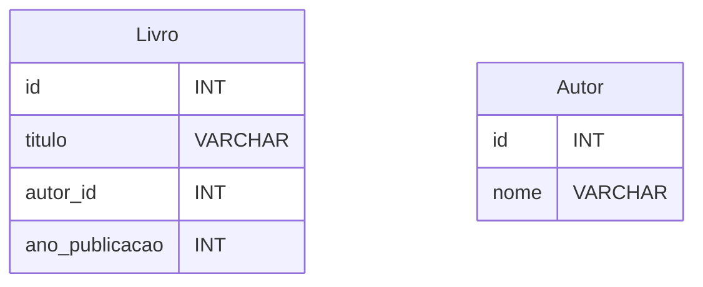
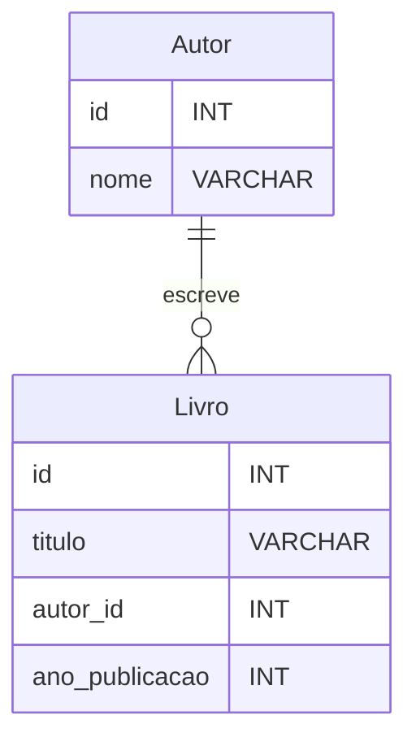
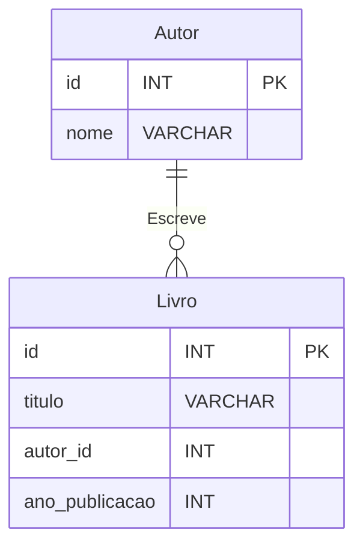
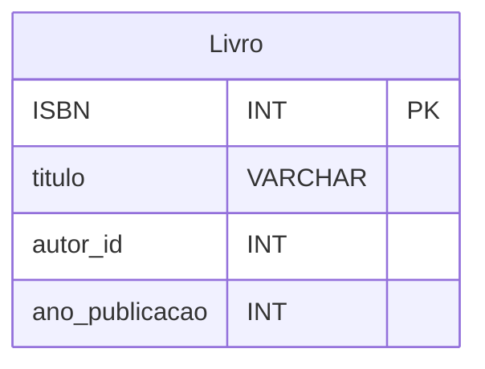
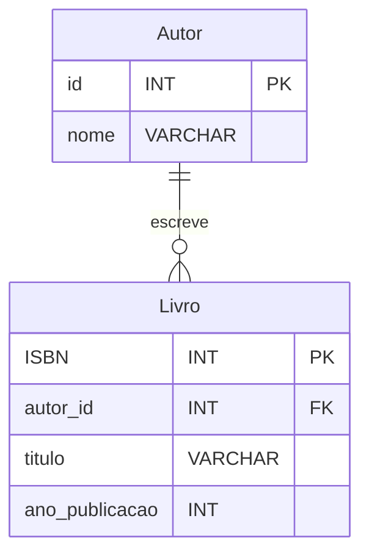

A modelagem entidade-relacionamento (ER) é uma técnica amplamente utilizada na área de banco de dados para projetar e representar os relacionamentos entre entidades. Essa abordagem gráfica permite visualizar e descrever a estrutura e as interações de um sistema de informação. Neste artigo, exploraremos os conceitos-chave da modelagem ER e como criar diagramas usando a sintaxe Mermaid.

## Entidades e Relacionamentos

Na modelagem ER, as entidades representam objetos ou conceitos do mundo real que desejamos armazenar informações em um banco de dados. Cada entidade possui atributos que descrevem suas características. Por exemplo, em um sistema de gerenciamento de biblioteca, podemos ter a entidade "Livro" com atributos como "Título", "Autor" e "Ano de Publicação".

Os relacionamentos definem as interações entre as entidades. Podem ser do tipo um para um, um para muitos ou muitos para muitos. Por exemplo, em um sistema de vendas online, podemos ter o relacionamento entre as entidades "Cliente" e "Pedido", onde um cliente pode realizar vários pedidos, mas um pedido pertence a um único cliente.

## Diagramas Entidade-Relacionamento com Mermaid

O Mermaid é uma linguagem de marcação para a criação de diagramas gráficos, incluindo diagramas entidade-relacionamento. Ele permite representar visualmente as entidades, atributos e relacionamentos de forma clara e concisa. A seguir, veremos como criar um diagrama ER básico usando a sintaxe Mermaid.

### Passo 1: Configuração

Antes de começar a criar o diagrama, é necessário configurar o ambiente para a renderização do Mermaid. Certifique-se de ter a biblioteca Mermaid instalada e a sintaxe suportada no ambiente em que está trabalhando.

### Passo 2: Definir Entidades e Atributos

Comece definindo as entidades e seus atributos. Por exemplo, para um sistema de gerenciamento de biblioteca, podemos ter as entidades "Livro" e "Autor" com os atributos relevantes. Usando a sintaxe Mermaid, ficaria assim:

### Passo 3: Adicionar Relacionamentos

Em seguida, adicione os relacionamentos entre as entidades. Por exemplo, no sistema de gerenciamento de biblioteca, podemos estabelecer um relacionamento "Um para Muitos" entre "Autor" e "Livro", indicando que um autor pode ter vários livros. Usando a sintaxe Mermaid, ficaria assim:

Neste exemplo, o símbolo `||--o{` representa o relacionamento "Um para Muitos", onde o lado "Autor" é o lado "Um" e o lado "Livro" é o lado "Muitos".

### Passo 4: Personalizar e

Refinar o Diagrama

Depois de adicionar as entidades e os relacionamentos básicos, você pode personalizar e refinar o diagrama de acordo com suas necessidades. Você pode adicionar cardinalidades, chaves primárias, restrições e outros elementos conforme necessário.

Neste exemplo, adicionamos o rótulo "Escreve" ao relacionamento entre "Autor" e "Livro" para indicar a natureza do relacionamento.

## Chave Primária e Chave Estrangeira

Na modelagem entidade-relacionamento (ER), a utilização de chaves primárias e chaves estrangeiras é fundamental para estabelecer relacionamentos e garantir a integridade dos dados. Neste artigo, vamos explorar esses conceitos e entender como eles são representados nos diagramas ER.

### Chave Primária

Uma chave primária é um atributo ou conjunto de atributos que identifica exclusivamente uma entidade em uma tabela. Ela garante que cada registro em uma tabela seja único e permite o acesso rápido aos dados. A chave primária é representada na modelagem ER como uma chave sublinhada.

Por exemplo, considerando a entidade "Livro" em um sistema de biblioteca, podemos atribuir o atributo "ISBN" como a chave primária, já que cada livro possui um número ISBN exclusivo. A representação no diagrama ER seria a seguinte:

No exemplo acima, o atributo "ISBN" é identificado como a chave primária da entidade "Livro" utilizando o sufixo [PK] após o nome do atributo.

### Chave Estrangeira

Uma chave estrangeira é um atributo ou conjunto de atributos que faz referência a uma chave primária de outra tabela. Ela estabelece uma relação entre duas tabelas e permite a integridade referencial dos dados. A chave estrangeira é representada na modelagem ER como uma seta que aponta para a tabela referenciada.

Continuando com o exemplo da biblioteca, suponha que exista uma entidade "Autor" e queremos relacionar os autores aos livros. Podemos adicionar uma chave estrangeira na tabela "Livro" que referencia a chave primária da tabela "Autor", como mostrado no diagrama ER a seguir:

No exemplo acima, o atributo "autor_id" na tabela "Livro" é uma chave estrangeira que faz referência à chave primária "id" na tabela "Autor". Essa relação é indicada pela seta que aponta da tabela "Autor" para a tabela "Livro".

A utilização de chaves primárias e chaves estrangeiras na modelagem ER permite estabelecer relacionamentos entre as entidades, garantir a consistência dos dados e facilitar as operações de consulta e manipulação. Esses conceitos são fundamentais para a construção de um banco de dados bem estruturado e eficiente.

## Conclusão

A modelagem entidade-relacionamento é uma técnica valiosa para projetar e representar a estrutura de um banco de dados. O uso do Mermaid como uma ferramenta para criar diagramas ER torna o processo mais visual e compreensível. Ao seguir os passos descritos neste artigo, você poderá criar seus próprios diagramas ER usando a sintaxe Mermaid e representar com precisão as entidades, atributos e relacionamentos do seu sistema de informação.

## Referências

[Workbench - Criando  diagrama ER, exportando para SQL, implemantando  e manipulando](https://www.youtube.com/watch?v=WTyqp5PjdGI)

[Apostila Seduc - {{site.data.references.apostilas.informatica[0].name}} pdf]({{site.data.references.apostilas.informatica[0].link}})

[Livro restrito da biblioteca Senac - {{site.data.references.apostilas.senac[15].name}}]({{site.data.references.apostilas.senac[15].link}})

[Livro restrito da biblioteca Senac - {{site.data.references.apostilas.senac[16].name}}]({{site.data.references.apostilas.senac[16].link}})

[Flowchart Maker & Online Diagram Software](https://app.diagrams.net/)
