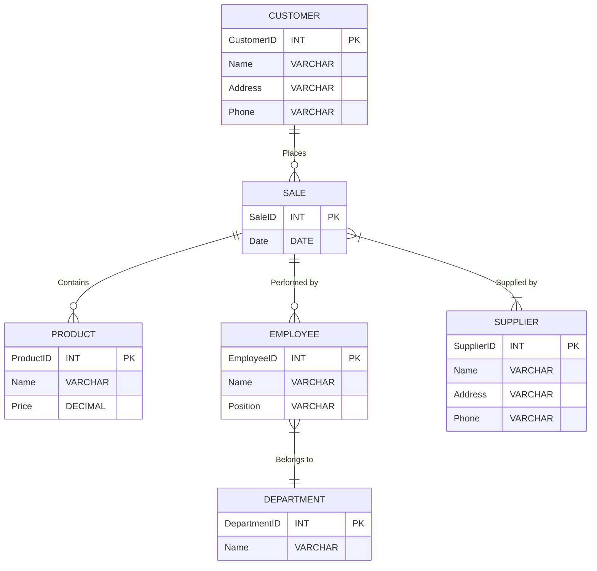

Quando se trata de modelar um banco de dados relacional, é essencial compreender conceitos como chave primária, chave estrangeira, atributos e relacionamentos. Esses elementos desempenham um papel fundamental na organização e na integridade dos dados. Neste artigo, discutiremos cada um desses conceitos e identificaremos onde a chave estrangeira é aplicada nos relacionamentos entre tabelas.

## Chave Primária

A chave primária é um atributo (ou um conjunto de atributos) que identifica exclusivamente cada registro em uma tabela de um banco de dados. Ela garante a unicidade dos dados e é fundamental para manter a integridade referencial. A chave primária não pode ter valores nulos e deve ser única para cada linha da tabela.

A chave primária pode ser composta por um único atributo (chave primária simples) ou por um conjunto de atributos (chave primária composta). Por exemplo, em uma tabela de "Clientes", o atributo "ID do Cliente" pode ser definido como a chave primária. Isso significa que cada cliente terá um ID exclusivo, e essa chave primária será usada para identificar e relacionar os dados desse cliente em outras tabelas, se necessário.

## Chave Estrangeira

A chave estrangeira é um atributo (ou um conjunto de atributos) que estabelece uma relação entre duas tabelas em um banco de dados relacional. Ela cria um vínculo entre a tabela que contém a chave primária referenciada e a tabela que possui a chave estrangeira. A chave estrangeira representa uma referência a uma chave primária em outra tabela e é usada para manter a integridade referencial e estabelecer os relacionamentos entre os dados.

Quando uma chave estrangeira é definida em uma tabela, ela indica que o valor desse atributo em cada registro deve corresponder a um valor existente na tabela referenciada. Por exemplo, suponha que tenhamos uma tabela de "Pedidos" e uma tabela de "Clientes". A tabela de "Pedidos" pode conter uma coluna chamada "ID do Cliente" como chave estrangeira, que se refere à chave primária "ID do Cliente" na tabela de "Clientes". Dessa forma, podemos estabelecer uma relação entre um pedido específico e o cliente associado a esse pedido.

## Atributos

Os atributos são as características ou as propriedades que descrevem os dados em uma tabela de banco de dados. Cada tabela é composta por uma ou mais colunas, e cada coluna representa um atributo. Por exemplo, em uma tabela de "Produtos", podemos ter atributos como "Nome do Produto", "Preço", "Quantidade em Estoque" e assim por diante. Os atributos são essenciais para fornecer detalhes sobre os dados armazenados em uma tabela.

Os atributos podem ter diferentes tipos de dados, como números, strings, datas e assim por diante. Eles também podem ter restrições, como serem obrigatórios (não nulos) ou terem um valor padrão.

## Relacionamentos e Aplicação da Chave Estrangeira

Os relacionamentos entre tabelas são estabelecidos por meio das chaves primárias e estrangeiras. Existem três tipos principais de relacionamentos: um para um, um para muitos e muit

os para muitos.

- **Relacionamento um para um**: Nesse tipo de relacionamento, um registro em uma tabela está relacionado a no máximo um registro em outra tabela. A chave primária da primeira tabela se torna a chave estrangeira na segunda tabela. Por exemplo, uma tabela de "Funcionários" pode ter uma chave primária "ID do Funcionário", que se torna a chave estrangeira em uma tabela de "Informações de Contato", onde cada funcionário pode ter apenas um conjunto de informações de contato.
- **Relacionamento um para muitos**: Nesse tipo de relacionamento, um registro em uma tabela pode estar relacionado a vários registros em outra tabela. A chave primária da primeira tabela se torna a chave estrangeira na segunda tabela. Por exemplo, uma tabela de "Departamentos" pode ter uma chave primária "ID do Departamento", que se torna a chave estrangeira em uma tabela de "Funcionários". Dessa forma, vários funcionários podem pertencer a um único departamento.
- **Relacionamento muitos para muitos**: Nesse tipo de relacionamento, vários registros em uma tabela podem estar relacionados a vários registros em outra tabela. Para estabelecer esse relacionamento, é necessário criar uma tabela intermediária, também conhecida como tabela de junção ou tabela associativa. Essa tabela contém as chaves primárias das duas tabelas relacionadas como chaves estrangeiras. Por exemplo, em um banco de dados de uma biblioteca, pode haver uma tabela de "Livros" e uma tabela de "Autores". Como um livro pode ter vários autores e um autor pode ter escrito vários livros, uma tabela de junção seria necessária para relacionar essas duas tabelas.

Em resumo, a chave primária e a chave estrangeira desempenham papéis fundamentais na organização e na integridade dos dados em um banco de dados relacional. A chave primária identifica exclusivamente cada registro em uma tabela, enquanto a chave estrangeira estabelece relacionamentos entre tabelas por meio da referência à chave primária em outra tabela. Esses conceitos são essenciais para garantir a consistência e a integridade dos dados em um ambiente de banco de dados.

## Exemplo

Situação atual: Uma loja de produtos diversos atualmente utiliza planilhas para a organização das vendas realizadas. Porém, algumas vezes os funcionários anotam as transações em papel, ou não preenchem todas as informações solicitadas nas planilhas. Com isso, a empresa vem sofrendo prejuízos, perda de informação e retrabalho. A empresa possui funcionários e fornecedores. A cada transação de venda, pode haver produtos de mais de um fornecedores. A cada transação de venda, pode haver produtos de mais de um fornecedor, porém a venda não pode ser compartilhada entre dois ou mais clientes.
Necessidade: Para o crescimento da empresa, o diretor decidiu investir em um sistema, e para isso necessita que sejam mapeadas as necessidades operacionais, a fim de que a modelagem do banco de dados do sistema seja entregue e o banco de dados implementado. O sistema deve ser capaz de armazenar informações de produtos, clientes, vendas realizadas, funcionários e seus respectivos departamentos.
Observações: Na loja, um cliente pode fazer compras, e cada compra pode conter diversos produtos. Os produtos vendidos são fornecidos por diversos fornecedores. As vendas são realizadas por um funcionário que pertence a somente um departamento. Os produtos vendidos são fornecidos por diversos fornecedores.

## Diagrama Entidade-Relacionamento

Com base no cenário apresentado, podemos criar um diagrama entidade-relacionamento (DER) para modelar as necessidades operacionais do sistema. O DER é uma representação visual das entidades (tabelas), seus atributos e os relacionamentos entre elas. Abaixo está o diagrama MERMAID com a modelagem proposta:



No diagrama acima, temos as seguintes entidades:

- **CUSTOMER (Cliente)**: Armazena informações dos clientes, como ID, nome, endereço e telefone.
- **PRODUCT (Produto)**: Armazena informações dos produtos, como ID, nome e preço.
- **SALE (Venda)**: Representa as vendas realizadas. Possui um ID único e a data da venda.
- **EMPLOYEE (Funcionário)**: Armazena informações dos funcionários, como ID, nome e cargo.
- **DEPARTMENT (Departamento)**: Representa os departamentos da empresa. Cada funcionário pertence a um departamento.
- **SUPPLIER (Fornecedor)**: Armazena informações dos fornecedores, como ID, nome, endereço e telefone.

Os relacionamentos no diagrama são definidos da seguinte forma:

- Um cliente (CUSTOMER) pode realizar várias vendas (SALE).
- Uma venda (SALE) pode conter vários produtos (PRODUCT).
- Uma venda (SALE) é realizada por um funcionário (EMPLOYEE).
- Um funcionário (EMPLOYEE) pertence a um departamento (DEPARTMENT).
- Uma venda (SALE) é fornecida por um ou mais fornecedores (SUPPLIER).

Essa modelagem permite que a empresa registre e relacione as informações necessárias para suas operações, incluindo clientes, produtos, vendas, funcionários, departamentos e fornecedores.

Com o diagrama entidade-relacionamento definido, é possível avançar para a implementação do banco de dados do sistema, levando em consideração as necessidades operacionais da loja.

em consideração as necessidades operacionais da loja.

## Script SQL

Para implementar o banco de dados com base no diagrama entidade-relacionamento apresentado, podemos utilizar a linguagem SQL para criar as tabelas correspondentes. Abaixo está um exemplo de script SQL para criação das tabelas:

```sql
-- Tabela CUSTOMER
CREATE TABLE CUSTOMER (
    CustomerID INT PRIMARY KEY,
    Name VARCHAR(50),
    Address VARCHAR(100),
    Phone VARCHAR(20)
);

-- Tabela PRODUCT
CREATE TABLE PRODUCT (
    ProductID INT PRIMARY KEY,
    Name VARCHAR(50),
    Price DECIMAL(10, 2)
);

-- Tabela SALE
CREATE TABLE SALE (
    SaleID INT PRIMARY KEY,
    Date DATE,
    CustomerID INT,
    EmployeeID INT,
    FOREIGN KEY (CustomerID) REFERENCES CUSTOMER(CustomerID),
    FOREIGN KEY (EmployeeID) REFERENCES EMPLOYEE(EmployeeID)
);

-- Tabela EMPLOYEE
CREATE TABLE EMPLOYEE (
    EmployeeID INT PRIMARY KEY,
    Name VARCHAR(50),
    Position VARCHAR(50),
    DepartmentID INT,
    FOREIGN KEY (DepartmentID) REFERENCES DEPARTMENT(DepartmentID)
);

-- Tabela DEPARTMENT
CREATE TABLE DEPARTMENT (
    DepartmentID INT PRIMARY KEY,
    Name VARCHAR(50)
);

-- Tabela SUPPLIER
CREATE TABLE SUPPLIER (
    SupplierID INT PRIMARY KEY,
    Name VARCHAR(50),
    Address VARCHAR(100),
    Phone VARCHAR(20)
);

-- Tabela de junção entre SALE e PRODUCT para representar a relação de "Contains"
CREATE TABLE SALE_PRODUCT (
    SaleID INT,
    ProductID INT,
    PRIMARY KEY (SaleID, ProductID),
    FOREIGN KEY (SaleID) REFERENCES SALE(SaleID),
    FOREIGN KEY (ProductID) REFERENCES PRODUCT(ProductID)
);

```

O script acima cria as tabelas `CUSTOMER`, `PRODUCT`, `SALE`, `EMPLOYEE`, `DEPARTMENT`, `SUPPLIER` e a tabela de junção `SALE_PRODUCT` para representar o relacionamento de "Contains" entre as tabelas `SALE` e `PRODUCT`.

As chaves primárias são definidas usando a cláusula `PRIMARY KEY`, enquanto as chaves estrangeiras são criadas usando a cláusula `FOREIGN KEY` seguida pela cláusula `REFERENCES`, indicando a tabela e a coluna referenciada.

É importante ressaltar que o script acima representa apenas a estrutura das tabelas. Dependendo das necessidades do sistema, é possível adicionar mais colunas e restrições para atender aos requisitos específicos da loja.

Com o banco de dados implementado, a loja poderá armazenar e gerenciar as informações dos clientes, produtos, vendas, funcionários, departamentos e fornecedores de forma organizada e integrada, contribuindo para uma melhor gestão das operações e evitando problemas como perda de informação e retrabalho.

## Referências

[Workbench - Criando  diagrama ER, exportando para SQL, implemantando  e manipulando](https://www.youtube.com/watch?v=WTyqp5PjdGI)

[Apostila Seduc - {{site.data.references.apostilas.informatica[0].name}} pdf]({{site.data.references.apostilas.informatica[0].link}})

[Livro restrito da biblioteca Senac - {{site.data.references.apostilas.senac[15].name}}]({{site.data.references.apostilas.senac[15].link}})

[Livro restrito da biblioteca Senac - {{site.data.references.apostilas.senac[16].name}}]({{site.data.references.apostilas.senac[16].link}})
